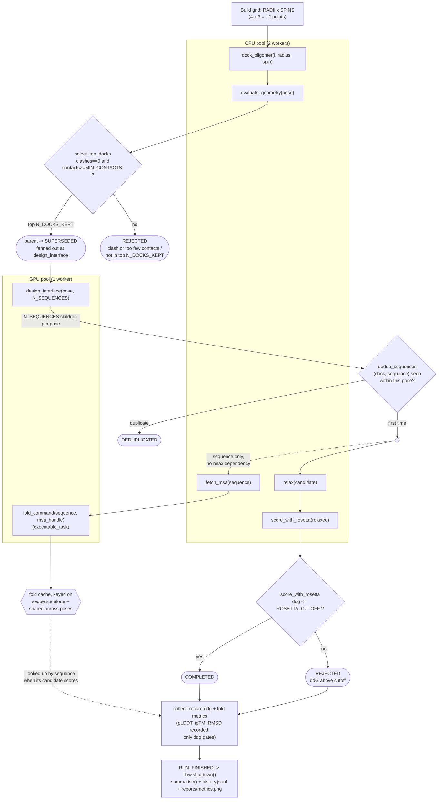

# v2 pipeline flow

What `main.py` actually executes, one campaign, stage 1 (naive: every dock finishes
before selection, every design finishes before dedup — no async refill yet). Kept in
sync with the code, not aspirational: regenerate this by hand whenever `run()` changes.

