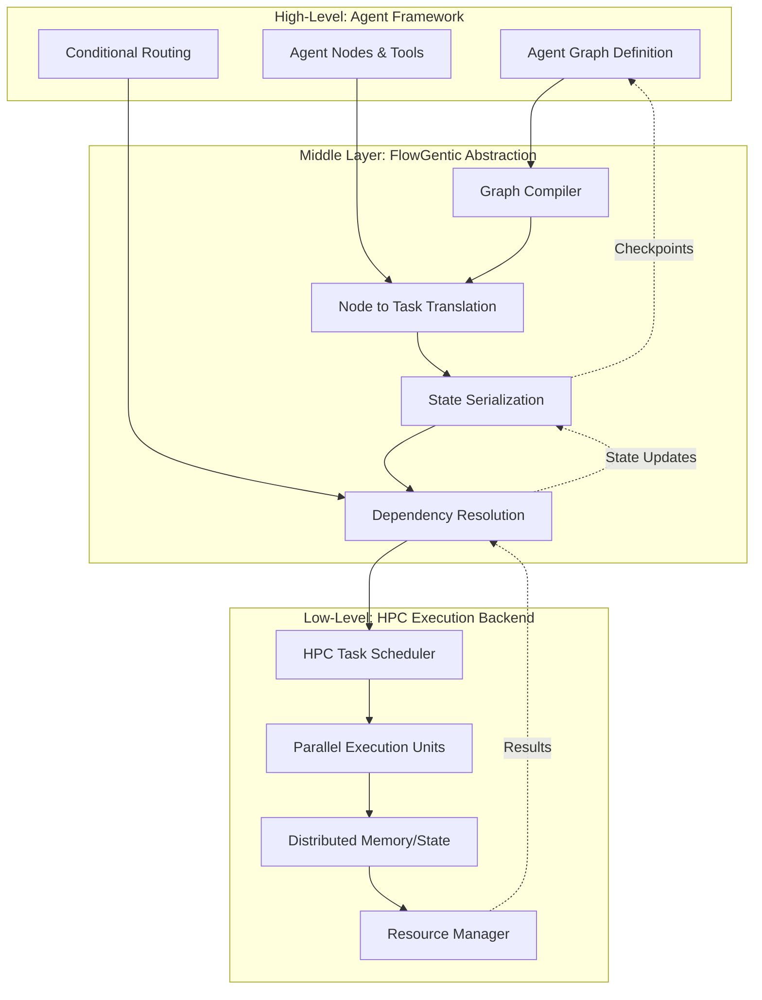
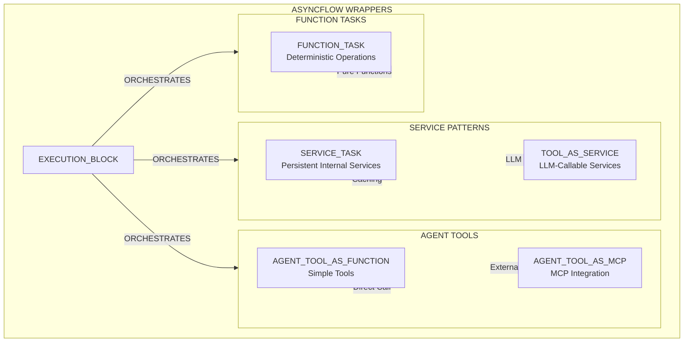

# Architecture

Flowgentic provides a thin, opinionated layer that standardizes agent components and lets you run the same logic on multi-agent orchestration frameworks (e.g. LangGraph) on HPC workflow engines (e.g. Radical AsyncFlow).

## Architecture: Execution Bridge Pattern

## Wrappers
If you have multiple wrappers inside a node we recommend to adhere to the following pattern in order to stick dependency resolution best practices:

However, if you don't have multiple dependencies in a given node, you can define the node with the `function_task` execution wrapper. More information [here](https://radical-cybertools.github.io/radical.asyncflow/composite_workflow/?h=block#example-blocks-with-dependency)

### Flow Type Categories

**Service Patterns** (Persistent, Stateful)
- `SERVICE_TASK`: Internal services with continual uptime (database pools, Redis clients)
- `TOOL_AS_SERVICE`: LLM-callable services with continual uptime (Weather APIs, search tools)

**Agent Tools** (LLM-Callable)
- `AGENT_TOOL_AS_FUNCTION`: Simple synchronous tools for LLMs
- `AGENT_TOOL_AS_MCP`: External MCP server integration

**Function Tasks** 
- `FUNCTION_TASK`: Non-LLM operations (validation, formatting)

**Execution Block**
- `EXECUTION_BLOCK`: LangGraph nodes (orchestration layer, optional)