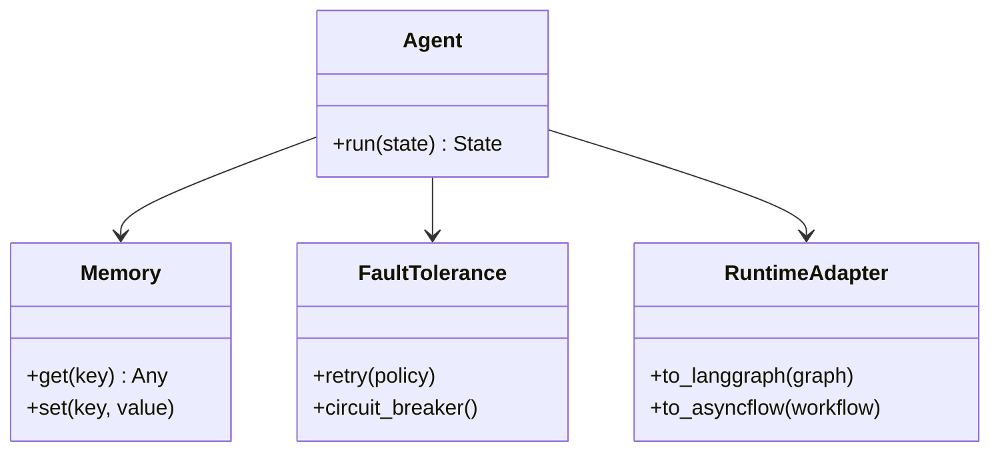

# Architecture

Flowgentic provides a thin, opinionated layer that standardizes agent components and lets you run the same logic on LangGraph or Radical AsyncFlow.

## Modules

- `flowgentic.langGraph`: Agents, memory, fault-tolerance, utilities
- `flowgentic.utils`: LLM providers and logging utilities
- `flowgentic.academy`: Integration helpers for Academy datasets/tools

## High-level UML

## Execution paths

- Local/dev: build graphs via `langGraph.agents` and run in-process
- Scale/HPC: adapt into AsyncFlow tasks with minimal changes

## Minimal overhead claim

Shared abstractions keep agent definitions identical while swapping only the runner. This avoids duplicate code and reduces migration cost to near-zero for typical sequential and branching graphs.
