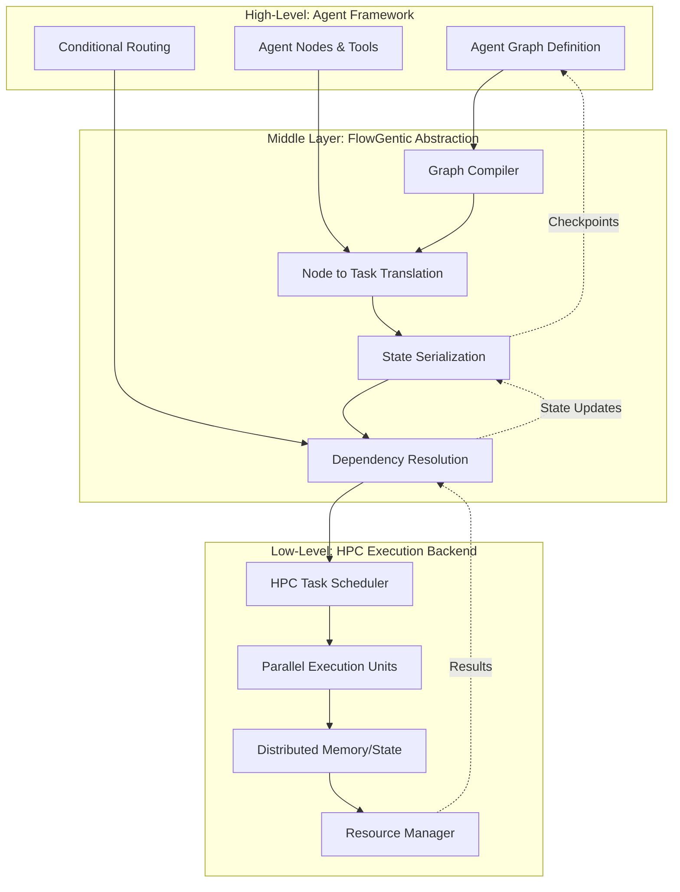
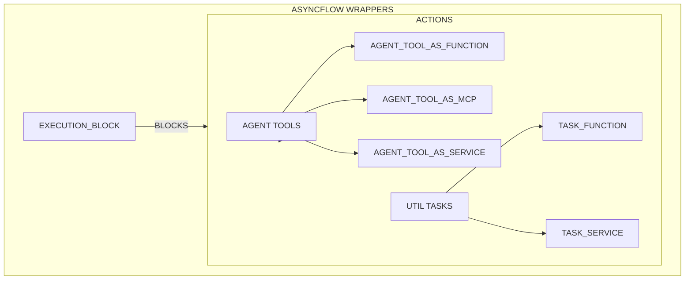

# Architecture

Flowgentic provides a thin, opinionated layer that standardizes agent components and lets you run the same logic on multi-agent orchestration frameworks (e.g. LangGraph) on HPC workflow engines (e.g. Radical AsyncFlow).

## Architecture: Execution Bridge Pattern

## Wrappers
