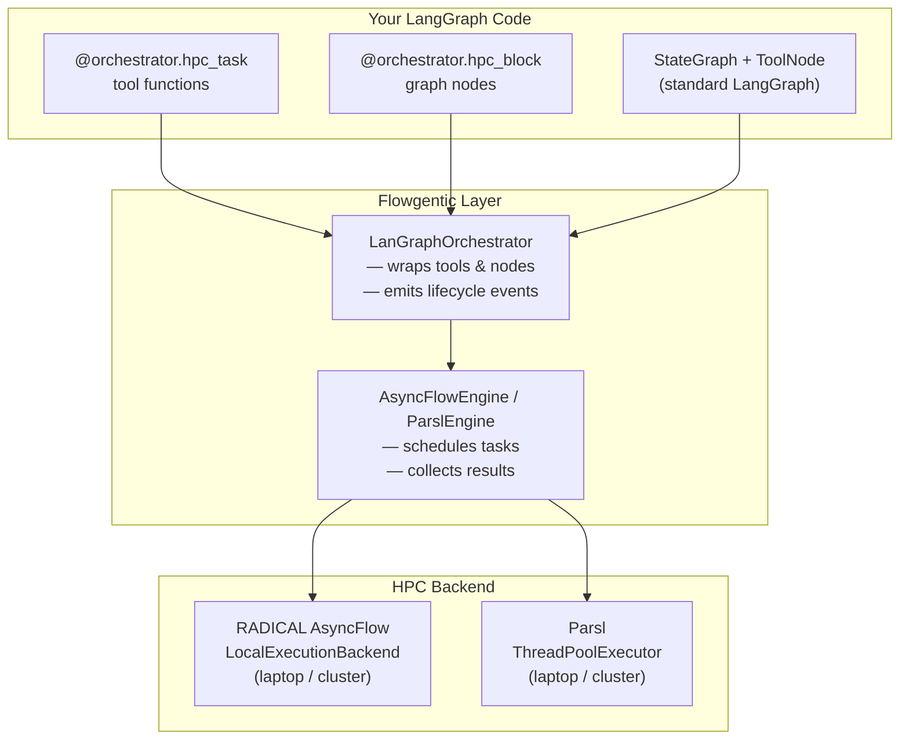

# Architecture

Flowgentic provides a thin layer that lets the same LangGraph agent code run on HPC workflow engines (RADICAL AsyncFlow, Parsl) via two decorators: `@orchestrator.hpc_task` and `@orchestrator.hpc_block`.

## Execution Bridge Pattern


```mermaid
flowchart TD
    subgraph UserCode["Your LangGraph Code"]
        A["@orchestrator.hpc_task\ntool functions"]
        B["@orchestrator.hpc_block\ngraph nodes"]
        C["StateGraph + ToolNode\n(standard LangGraph)"]
    end

    subgraph Flowgentic["Flowgentic Layer"]
        D["LanGraphOrchestrator\n— wraps tools & nodes\n— emits lifecycle events"]
        E["AsyncFlowEngine / ParslEngine\n— schedules tasks\n— collects results"]
    end

    subgraph Backend["HPC Backend"]
        F["RADICAL AsyncFlow\nLocalExecutionBackend\n(laptop / cluster)"]
        G["Parsl\nThreadPoolExecutor\n(laptop / cluster)"]
    end

    A --> D
    B --> D
    C --> D
    D --> E
    E --> F
    E --> G
```

## The Two Decorators

### `@orchestrator.hpc_task`

Wraps an `async` function so that when LangGraph's `ToolNode` calls it, the execution is dispatched to the HPC backend instead of running in the local event loop.

```python
engine       = AsyncFlowEngine(flow)
orchestrator = LanGraphOrchestrator(engine)

@orchestrator.hpc_task
async def fetch_weather(city: str = "SFO"):
    """Returns weather for a city."""
    await asyncio.sleep(2)          # runs on a backend slot, not the main loop
    return {"temperature": 22}
```

- The decorated function is also wrapped as a **LangChain tool** (via `@langchain_core.tools.tool`), so it can be passed directly to `ToolNode` and `llm.bind_tools()`.
- Multiple concurrent invocations are scheduled across available backend slots automatically.
- Lifecycle events (`tool_wrap_start/end`, `tool_invoke_start/end`) are emitted for observability.

### `@orchestrator.hpc_block`

Wraps a LangGraph **node function** so it executes as an HPC block on the backend.

```python
@orchestrator.hpc_block
async def agent_node(state: WorkflowState):
    response = await llm.ainvoke(state.messages)
    return {"messages": [response]}
```

- Emits `block_wrap_start/end` events.
- The returned wrapper is a plain async callable — pass it to `workflow.add_node()` as usual.

## Event Model

Both decorators emit structured timing events through the engine's observer. These are used by the benchmarking layer to measure compilation overhead, queueing latency, and execution time.

| Event | Emitted by | Meaning |
|---|---|---|
| `tool_wrap_start/end` | `hpc_task` decorator | Tool registration overhead |
| `tool_invoke_start/end` | `LanGraphOrchestrator` wrapper | Full lifecycle from LangGraph call to result return |
| `tool_invoke_start/end` | `AsyncFlowEngine.execute_tool` | Actual backend execution (excludes queueing) |
| `block_wrap_start/end` | `hpc_block` decorator | Node registration overhead |

## Supported Combinations

| Agent Framework | HPC Engine | Status |
|---|---|---|
| LangGraph | RADICAL AsyncFlow | ✅ Available |
| LangGraph | Parsl | ✅ Available |
| AutoGen | RADICAL AsyncFlow | 🟡 Pre-release |
| AutoGen | Parsl | 🟡 Pre-release |

See [phased_rollout.md](phased_rollout.md) for the full support matrix.

## Backend Setup

### RADICAL AsyncFlow (recommended for HPC)

```python
from concurrent.futures import ProcessPoolExecutor
from radical.asyncflow import LocalExecutionBackend, WorkflowEngine
from flowgentic.backend_engines.radical_asyncflow import AsyncFlowEngine

backend = await LocalExecutionBackend(ProcessPoolExecutor(max_workers=N))
flow    = await WorkflowEngine.create(backend)
engine  = AsyncFlowEngine(flow)

# ... run your agent ...

await flow.shutdown()
```

Replace `ProcessPoolExecutor` with your cluster executor (e.g. RADICAL Pilot) to scale beyond a single node.

### Parsl

```python
from parsl.config import Config
from parsl.executors import ThreadPoolExecutor
from flowgentic.backend_engines.parsl import ParslEngine

parsl_config = Config(executors=[ThreadPoolExecutor(max_threads=N, label="local")])
engine       = ParslEngine(parsl_config)
```
