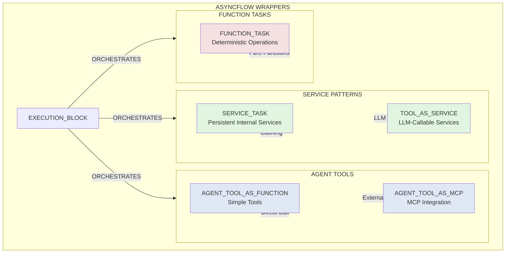

# Architecture

Flowgentic provides a thin, opinionated layer that standardizes agent components and lets you run the same logic on multi-agent orchestration frameworks (e.g. LangGraph) on HPC workflow engines (e.g. Radical AsyncFlow).

## Architecture: Execution Bridge Pattern

## Wrappers

### Flow Type Categories

**Service Patterns** (Persistent, Stateful)
- `SERVICE_TASK`: Internal services with caching (database pools, Redis clients)
- `TOOL_AS_SERVICE`: LLM-callable services with caching (Weather APIs, search tools)

**Agent Tools** (LLM-Callable)
- `AGENT_TOOL_AS_FUNCTION`: Simple synchronous tools for LLMs
- `AGENT_TOOL_AS_MCP`: External MCP server integration

**Function Tasks** (Deterministic)
- `FUNCTION_TASK`: Pure deterministic operations (validation, formatting)

All wrapped by:
- `EXECUTION_BLOCK`: LangGraph nodes (orchestration layer)