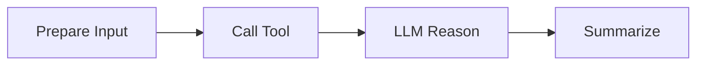

# Sequential Pattern

The sequential pattern composes a linear chain of nodes with clear inputs/outputs. It maps 1:1 to both LangGraph and Radical AsyncFlow.

## When to use

- Deterministic pipelines
- Post-processing chains
- ETL-like agent steps where backtracking is not needed

## Example from this repo

See `examples/langgraph-integration/design_patterns/sequential/main.py`.

## Implementation notes

- Node builders live under `examples/langgraph-integration/design_patterns/sequential/components`
- The pattern uses a simple builder to register tools and stitch nodes
- Fault boundaries can be placed between nodes for retries/isolation

## Adapting to AsyncFlow

- Wrap each node in an AsyncFlow task
- Preserve order; add dependencies `A -> B -> C -> D`
- Minimal code change: swap runner while keeping node functions intact

