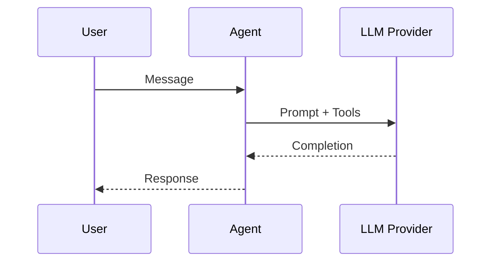

# Chatbot

Build a production-ready chatbot with minimal glue.

- Works with LangChain providers (OpenAI, Ollama, community)
- Memory and tools integration
- Swappable runtimes for dev vs HPC

## Example

See `examples/langgraph-integration/chatbot/main.py` for a minimal build.

## Architecture

