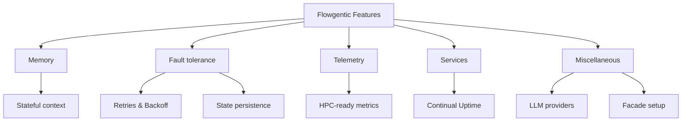

# Overview

Quick links to core features:

- [Memory](memory.md)
- [Fault tolerance](fault_tolerance.md)
- [Telemetry](telemetry.md)
- [Services](services.md)
- [Miscellaneous](miscellaneous.md)

```mermaid
graph TD
  A[Flowgentic Features] --> B[Memory]
  A --> C[Fault tolerance]
  A --> D[Telemetry]
  A --> E[Services]
  A --> F[Miscellaneous]

  B --> B1[Stateful context]
  C --> C1[Retries & Backoff]
  C --> C2[State persistence]
  D --> D1[HPC-ready metrics]
  E --> E1[Continual Uptime]
  F --> F1[LLM providers]
  F --> F2[Facade setup]
```
