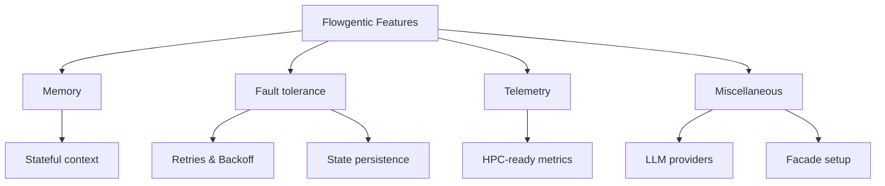

# Overview

Quick links to core features:

- [Memory](memory.md)
- [Fault tolerance](fault_tolerance.md)
- [Telemetry](telemetry.md)
- [Miscellaneous](miscellaneous.md)

```mermaid
graph TD
  A[Flowgentic Features] --> B[Memory]
  A --> C[Fault tolerance]
  A --> D[Telemetry]
  A --> E[Miscellaneous]

  B --> B1[Stateful context]
  C --> C1[Retries & Backoff]
  C --> C2[State persistence]
  D --> D1[HPC-ready metrics]
  E --> E1[LLM providers]
  E --> E2[Facade setup]

  click B "./memory.md" "Memory feature details"
  click C "./fault_tolerance.md" "Fault tolerance details"
  click D "./telemetry.md" "Telemetry details"
  click E "./miscellaneous.md" "Miscellaneous features"
```
