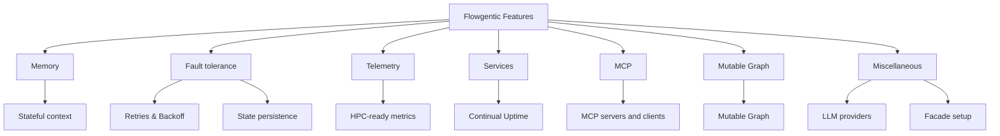

# Overview

Quick links to core features:

- [Memory](memory.md)
- [Fault tolerance](fault_tolerance.md)
- [Mutable Graph](mutable_graph.md)
- [Telemetry](telemetry.md)
- [Services](services.md)
- [MCP](mcp.md)
- [Miscellaneous](miscellaneous.md)

