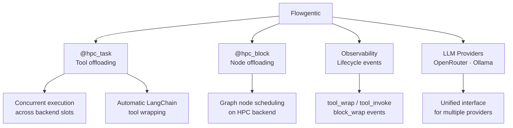

# Features

```mermaid
graph TD
  A[Flowgentic] --> B["@hpc_task\nTool offloading"]
  A --> C["@hpc_block\nNode offloading"]
  A --> D[Observability\nLifecycle events]
  A --> E[LLM Providers\nOpenRouter · Ollama]

  B --> B1[Concurrent execution\nacross backend slots]
  B --> B2[Automatic LangChain\ntool wrapping]
  C --> C1[Graph node scheduling\non HPC backend]
  D --> D1[tool_wrap / tool_invoke\nblock_wrap events]
  E --> E1[Unified interface\nfor multiple providers]
```

## `@hpc_task` — Tool offloading

The `@orchestrator.hpc_task` decorator registers an async function as both a **LangChain tool** and an **HPC task**. When LangGraph's `ToolNode` calls it, execution is dispatched to the configured backend instead of the local event loop.

- Concurrent invocations are automatically distributed across available backend slots.
- Works with `ProcessPoolExecutor` locally or any cluster executor on HPC.

See [Architecture](../architecture.md#the-two-decorators) for full details.

## `@hpc_block` — Node offloading

The `@orchestrator.hpc_block` decorator wraps a LangGraph node function so it executes as an HPC block, enabling coordination of multiple tasks within a single graph step.

See [Architecture](../architecture.md#the-two-decorators) for full details.

## Observability — Lifecycle events

Both decorators emit structured timing events through the engine observer. Events cover registration overhead (`tool_wrap_*`, `block_wrap_*`) and per-invocation timing (`tool_invoke_*`). These feed directly into the benchmarking layer.

See [Architecture — Event Model](../architecture.md#event-model) for the full event table.

## LLM Providers

Flowgentic ships a unified `ChatLLMProvider` interface that currently supports:

- **OpenRouter** — access to Google, Anthropic, OpenAI, and other hosted models.
- **Ollama** — local models via the Ollama runtime.
