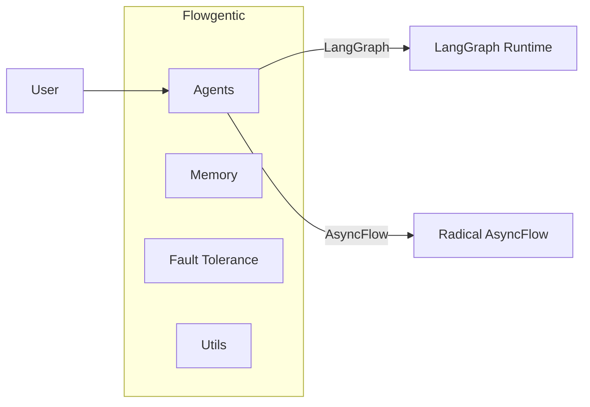

# Flowgentic

Build and run modern agentic workflows on HPC with minimal overhead. Flowgentic bridges LangGraph and Radical AsyncFlow, so you can prototype locally and scale to clusters without rewrites.

- Fast prototyping with LangGraph-compatible components
- Seamless execution on HPC using Radical AsyncFlow
- Batteries-included: memory, fault tolerance, phased rollout, chatbot builder

## Quickstart

```bash
pip install mkdocs-material mkdocstrings[python]
# in repo root
mkdocs serve
```

## Why Flowgentic

- Minimal dev friction between ecosystems (LangGraph ↔ Radical AsyncFlow)
- Production-minded primitives: logging, memory, retries, fault boundaries
- Works in both interactive notebooks and batch schedulers

## Architecture snapshot



Explore the sections on the left for patterns, features, API reference, and examples.
