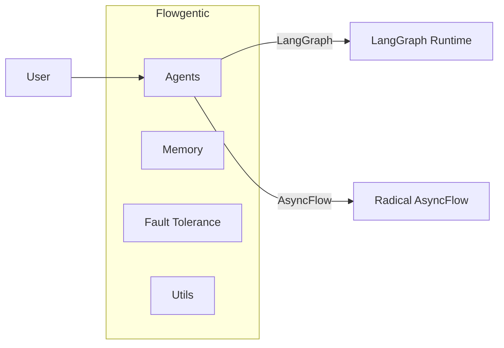

# Flowgentic

Build and run modern agentic workflows on HPC with minimal overhead. Flowgentic bridges HPC workflow engines and agent orchestration frameworks, so you can prototype locally and scale to clusters without rewrites.

### What can I use this for?

- **HPC execution of agent workflows**: Run multiagent graphs (e.g., langraph) on HPC via multiple HPC workflow engines (e.g., Radical Asyncflow). Note, while the canonical usecase is in an HPC execution context, you can run this in your laptop using as backend the `ConcurrentExecutionBackend`
- **Concurrent tool and agent blocks**: Offload parallelizable work to HPC backends.
- **Production-oriented patterns**: Start from examples that implement sequential, supervisor and hierarchical patterns with typed state, tool registries, and error handling.
- **Memory Capabilities**: Used a range of memory solutions for managing context engineering. From shared-node memory to agent-based summarization, we provide a suite of efficient and scalable memory mechanism
- **Telemetry**: Analyze your workflow execution with HPC-accomodated telemetry via the [Observe package](https://github.com/stride-research/observe) (under development). We also provide agents introspection that summarize agents decisions, avoiding the hussle of going through thousands of lines of logs.


## Quickstart
### 1) Installation
```bash
# 1) pyproject.toml
dependencies = [
    ...,
    "flowgentic @ git+https://github.com/stride-research/flowgentic/flowgentic.git@main",
    ...

]
# 2) pip3 
pip3 install "git+https://github.com/stride-research/flowgentic.git@main#egg=flowgentic"

# 3) cloning this repo
python3.10 -m venv .venv
make install 

```
If you are in MacOS you may need to install graphviz pluggins:
```bash
# For MacOS
brew install graphviz
sudo dot -c

```
### 2) Environmental variables
- **OPEN_ROUTER_API_KEY**: required if you use the OpenRouter-backed LLM provider.
- `.env` files are supported via `python-dotenv` if you call `load_dotenv()`.

```bash
export OPEN_ROUTER_API_KEY=sk-or-...
```

### 3) `config.yml`
- You can modify the `config.yml` at the top level of this repo in order to adjust different settings affecting the package (e.g., folders names for artifacts, logger level)


## Architecture overview



Explore the sections on the left for patterns, features, API reference, and examples.


