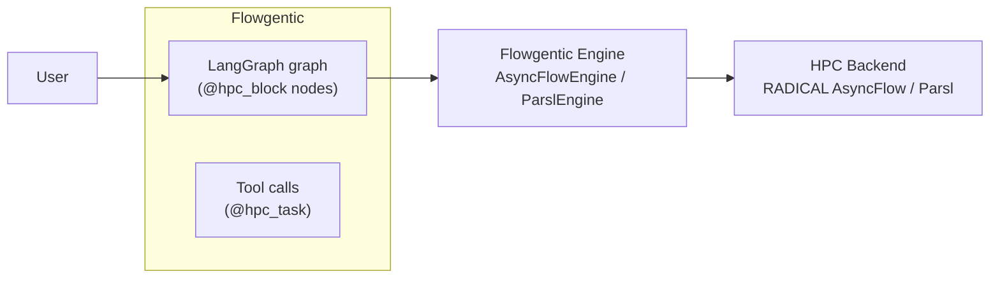

# Flowgentic

Build and run modern agentic workflows on HPC with minimal overhead. Flowgentic bridges HPC workflow engines and agent orchestration frameworks so you can prototype locally and scale to clusters without rewrites.

### What can I use this for?

- **HPC execution of agent tool calls**: Offload LangGraph tool calls to HPC backends (RADICAL AsyncFlow, Parsl) with two decorators and zero graph rewrites.
- **Concurrent tool execution**: Parallelise multiple tool invocations across backend slots automatically.
- **Local-to-cluster portability**: Swap `LocalExecutionBackend` (laptop) for a cluster-backed executor without changing any agent code.
- **Production-oriented patterns**: Start from examples that implement sequential, supervisor, and hierarchical patterns with typed state, tool registries, and error handling.


## Quickstart

### 1) Installation

```bash
# pyproject.toml
dependencies = [
    "flowgentic @ git+https://github.com/stride-research/flowgentic.git@main",
]

# pip
pip install "git+https://github.com/stride-research/flowgentic.git@main#egg=flowgentic[langgraph,asyncflow]"

# clone + venv
python3.10 -m venv .venv
make install-benchmark   # installs langgraph + asyncflow + dev deps
```

### 2) Environment variables

- **OPEN_ROUTER_API_KEY**: required if you use the OpenRouter-backed LLM provider.
- `.env` files are supported via `python-dotenv` if you call `load_dotenv()`.

```bash
export OPEN_ROUTER_API_KEY=sk-or-...
```

### 3) Minimal example (LangGraph + RADICAL AsyncFlow)

```python
import asyncio
from concurrent.futures import ProcessPoolExecutor
from typing import Annotated

from langgraph.graph import StateGraph, add_messages
from langgraph.prebuilt import ToolNode
from pydantic import BaseModel
from radical.asyncflow import LocalExecutionBackend, WorkflowEngine

from flowgentic.agent_orchestration_frameworks.langgraph import LanGraphOrchestrator
from flowgentic.backend_engines.radical_asyncflow import AsyncFlowEngine


class WorkflowState(BaseModel):
    messages: Annotated[list, add_messages]


async def main():
    # 1. Boot the HPC backend
    backend = await LocalExecutionBackend(ProcessPoolExecutor(max_workers=4))
    flow    = await WorkflowEngine.create(backend)

    # 2. Wrap it in Flowgentic
    engine      = AsyncFlowEngine(flow)
    orchestrator = LanGraphOrchestrator(engine)

    # 3. Decorate tools — they are now scheduled on the HPC backend
    @orchestrator.hpc_task
    async def fetch_weather(city: str = "SFO"):
        """Returns weather for a city."""
        await asyncio.sleep(2)          # simulate real work
        return {"temperature": 22, "city": city}

    @orchestrator.hpc_task
    async def fetch_traffic(city: str = "SFO"):
        """Returns traffic level for a city."""
        await asyncio.sleep(2)
        return {"traffic_pct": 75, "city": city}

    tools = [fetch_weather, fetch_traffic]

    # 4. Decorate graph nodes (LangGraph blocks)
    @orchestrator.hpc_block
    async def agent_node(state: WorkflowState):
        response = await llm.ainvoke(state.messages)
        return {"messages": [response]}

    # 5. Build and run the LangGraph graph as normal
    def should_continue(state):
        last = state.messages[-1]
        return "tools" if getattr(last, "tool_calls", None) else "end"

    workflow = StateGraph(WorkflowState)
    workflow.add_node("agent", agent_node)
    workflow.add_node("tools", ToolNode(tools))
    workflow.set_entry_point("agent")
    workflow.add_conditional_edges("agent", should_continue,
                                   {"tools": "tools", "end": "__end__"})
    workflow.add_edge("tools", "agent")
    workflow.set_finish_point("agent")

    app    = workflow.compile()
    result = await app.ainvoke(
        {"messages": [("user", "What's the weather and traffic in SFO?")]}
    )
    print(result)

    await flow.shutdown()


asyncio.run(main())
```

## Architecture overview


```mermaid
flowchart LR
  User --> LangGraph
  subgraph Flowgentic
    LangGraph["LangGraph graph\n(@hpc_block nodes)"]
    Tools["Tool calls\n(@hpc_task)"]
  end
  LangGraph --> Engine["Flowgentic Engine\nAsyncFlowEngine / ParslEngine"]
  Engine --> Backend["HPC Backend\nRADICAL AsyncFlow / Parsl"]
```

See the [Architecture](architecture.md) page for details on the execution bridge pattern and the two decorators.
