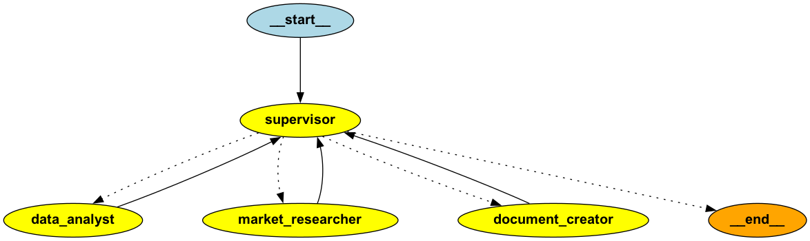

# MULTI-AGENT GRAPH



# 📊 LangGraph Execution Report

**Generated on:** `2025-10-09 16:55:45`
**Total Duration:** `27.067 seconds`

## 📈 Aggregate Statistics

- **Total Tokens Used:** `3,200`
- **Total Tool Calls:** `4`
- **Total Tool Executions:** `4`
- **Total Messages:** `5`
- **Models Used:** `google/gemini-2.5-flash`
- **Number of Nodes:** `4`

--- 

## 📝 Execution Summary

| Node Name           | Duration (s) | Tokens | Tools | New Messages |
|---------------------|--------------|--------|-------|---------------|
| `supervisor_20251009-165551-833` | 0.0000       | 0      | 0     | 0             |
| `supervisor_20251009-165601-826` | 0.0000       | 0      | 0     | 0             |
| **Total:supervisor** | 0.0000     | 0    | 0   | 0           |
| `data_analyst_20251009-165556-374` | 4.5378       | 1127   | 2     | 5             |
| **Total:data_analyst** | 4.5378     | 1127 | 2   | 0           |
| `market_researcher_20251009-165610-943` | 9.1103       | 2073   | 2     | 5             |
| **Total:market_researcher** | 9.1103     | 2073 | 2   | 0           |
| `document_creator` | not visited | <n/a>  | <n/a> | <n/a>         |


## 🔍 Node Details

--- 

### 1. Node: `supervisor`

**Description:**
```
Supervisor routing decision
```

- **Timestamp:** `16:55:51.833`
- **Duration:** `0.0 seconds`
- **Messages Before/After:** `2` → `2` (➕ 0)
- **State Keys:** `messages`

**📥 Model Final Response:**
```text
Command: routing to data_analyst
```

 **FULL CONVERSATION HISTORY FOR supervisor:**

**💬 Messages Added (1):**
1. **SupervisorRoute**
   - **Role:** `assistant`
   - **Content:** `transfer_to_data_analyst: Gather all relevant customer data for 'TechCorp Industries'. This should include their purchase history, any existing performance metrics, and key contact information. This i...`
--- 

### 2. Node: `data_analyst`

**Description:**
```
Data Analysis Agent - Fetches customer data and performance metrics.
```

- **Timestamp:** `16:55:51.836`
- **Duration:** `4.5378 seconds`
- **Messages Before/After:** `0` → `5` (➕ 5)
- **State Keys:** `messages`

**🤖 Model Information:**
- **Model Name:** `google/gemini-2.5-flash`
- **Finish Reason:** `tool_calls`

**📊 Token Usage:**
- **Input Tokens:** `765`
- **Output Tokens:** `362`
- **Total Tokens:** `1,127`

**📥 Model Final Response:**
```text
Here's TechCorp Industries' customer data:

**Account Overview:**
*   **Customer Since:** March 15, 2021
*   **Account Status:** Premium
*   **Primary Contact:** Jane Smith, VP Operations
*   **Last Purchase:** September 22, 2024
*   **Total Purchases:** 12
*   **Total Revenue:** $245,000
*   **Satisfaction Score:** 4.7/5
*   **Support Tickets:** 8

**Past Products & Services:**
*   Enterprise Suite v2.1
*   Analytics Dashboard Pro
*   API Integration Package

**Performance Metrics & ROI:**

**Growth Metrics (Year-over-Year & Quarter-over-Quarter):**
*   **Revenue Growth:** +28% YoY
*   **User Growth:** +34% YoY
*   **Engagement Increase:** +41% QoQ

**Usage Metrics:**
*   **Daily Active Users:** 45
*   **Monthly Active Users:** 78
*   **API Calls Per Month:** 1.2 Million
*   **Feature Adoption Rate:** 82%

**ROI Analysis:**
*   **Current ROI:** 285%
*   **Time to Value:** 3.2 months
*   **Cost Savings:** $127,000/year

**Benchmark Comparison:**
*   Performing 23% above industry average.
```

**🛠️ Tool Calls (2):**
1. **Tool:** `fetch_customer_history`
   - **Call ID:** `tool_0_fetch_customer_history_Kf7fHMjkyXu7Dg1p8bFx`
   - **Arguments:** `{'customer_name': 'TechCorp Industries'}`
2. **Tool:** `analyze_performance_metrics`
   - **Call ID:** `tool_1_analyze_performance_metrics_cUjQxyzHc7FPR12KAh1R`
   - **Arguments:** `{'customer_name': 'TechCorp Industries'}`

**✅ Tool Executions (2):**
1. **Tool:** `fetch_customer_history`
   - **Status:** `success`
   - **Call ID:** `tool_0_fetch_customer_history_Kf7fHMjkyXu7Dg1p8bFx`
   - **Response:** `{
  "customer_since": "2021-03-15",
  "total_purchases": 12,
  "total_revenue": "$245,000",
  "last_purchase": "2024-09-22",
  "primary_contact": "Jane Smith, VP Operations",
  "account_status": "Premium",
  "past_products": [
    "Enterprise Suite v2.1",
    "Analytics Dashboard Pro",
    "API Integration Package"
  ],
  "support_tickets": 8,
  "satisfaction_score": 4.7
}`
2. **Tool:** `analyze_performance_metrics`
   - **Status:** `success`
   - **Call ID:** `tool_1_analyze_performance_metrics_cUjQxyzHc7FPR12KAh1R`
   - **Response:** `{
  "roi_analysis": {
    "current_roi": "285%",
    "time_to_value": "3.2 months",
    "cost_savings": "$127,000/year"
  },
  "usage_metrics": {
    "daily_active_users": 45,
    "monthly_active_users": 78,
    "feature_adoption_rate": "82%",
    "api_calls_per_month": "1.2M"
  },
  "growth_metrics": {
    "user_growth": "+34% YoY",
    "revenue_growth": "+28% YoY",
    "engagement_increase": "+41% QoQ"
  },
  "benchmark_comparison": "Performing 23% above industry average"
}`

 **FULL CONVERSATION HISTORY FOR data_analyst:**

**💬 Messages Added (5):**
1. **HumanMessage** (ID: `397f7fd2-8621-48b3-8...`)
   - **Content:** `Gather all relevant customer data for 'TechCorp Industries'. This should include their purchase history, any existing performance metrics, and key contact information. This information will be used fo...`
2. **AIMessage** (ID: `run--1d94bb2a-5ff0-4...`)
   - **Has Tool Calls:** ✅
   - **Content:** ``
3. **ToolMessage** (ID: `7a295b5f-bc24-4b39-8...`)
   - **Tool Call ID:** `tool_0_fetch_customer_history_Kf7fHMjkyXu7Dg1p8bFx`
   - **Content:** `{
  "customer_since": "2021-03-15",
  "total_purchases": 12,
  "total_revenue": "$245,000",
  "last_purchase": "2024-09-22",
  "primary_contact": "Jane Smith, VP Operations",
  "account_status": "Prem...`
4. **ToolMessage** (ID: `44c0ed4f-a198-49fa-a...`)
   - **Tool Call ID:** `tool_1_analyze_performance_metrics_cUjQxyzHc7FPR12KAh1R`
   - **Content:** `{
  "roi_analysis": {
    "current_roi": "285%",
    "time_to_value": "3.2 months",
    "cost_savings": "$127,000/year"
  },
  "usage_metrics": {
    "daily_active_users": 45,
    "monthly_active_user...`
5. **AIMessage** (ID: `run--29af7dfc-504e-4...`)
   - **Content:** `Here's TechCorp Industries' customer data:

**Account Overview:**
*   **Customer Since:** March 15, 2021
*   **Account Status:** Premium
*   **Primary Contact:** Jane Smith, VP Operations
*   **Last P...`

**🔄 State Changes:**
```json
{
  "messages": {
    "changed_from": "[[HumanMessage(content=\"Gather all relevant customer data for 'TechCorp Industries'. This should include their purchase history, any existing performance metrics, and key contact information. This information will be used for the first section of a sales proposal.\", additional_kwargs={}, response_metadata={})]]",
    "changed_to": "[[HumanMessage(content=\"Gather all relevant customer data for 'TechCorp Industries'. This should include their purchase history, any existing performance metrics, and key contact information. This information will be used for the first section of a sales proposal.\", additional_kwargs={}, response_metadata={}, id='397f7fd2-8621-48b3-83c4-220676d59262'), AIMessage(content='', additional_kwargs={'tool_calls': [{'id': 'tool_0_fetch_customer_history_Kf7fHMjkyXu7Dg1p8bFx', 'function': {'arguments': '{\"customer_name\":\"TechCorp Industries\"}', 'name': 'fetch_customer_history'}, 'type': 'function', 'index': 0}, {'id': 'tool_1_analyze_performance_metrics_cUjQxyzHc7FPR12KAh1R', 'function': {'arguments': '{\"customer_name\":\"TechCorp Industries\"}', 'name': 'analyze_performance_metrics'}, 'type': 'function', 'index': 1}], 'refusal': None}, response_metadata={'token_usage': {'completion_tokens': 42, 'prompt_tokens': 197, 'total_tokens': 239, 'completion_tokens_details': {'accepted_prediction_tokens': None, 'audio_tokens': None, 'reasoning_tokens': 0, 'rejected_prediction_tokens': None, 'image_tokens': 0}, 'prompt_tokens_details': {'audio_tokens': None, 'cached_tokens': 0}}, 'model_name': 'google/gemini-2.5-flash', 'system_fingerprint': None, 'id': 'gen-1760021752-2zdC5TQuTzwVhrKb6ydH', 'service_tier': None, 'finish_reason': 'tool_calls', 'logprobs': None}, name='data_analyst', id='run--1d94bb2a-5ff0-4832-a6d7-e6a07140524c-0', tool_calls=[{'name': 'fetch_customer_history', 'args': {'customer_name': 'TechCorp Industries'}, 'id': 'tool_0_fetch_customer_history_Kf7fHMjkyXu7Dg1p8bFx', 'type': 'tool_call'}, {'name': 'analyze_performance_metrics', 'args': {'customer_name': 'TechCorp Industries'}, 'id': 'tool_1_analyze_performance_metrics_cUjQxyzHc7FPR12KAh1R', 'type': 'tool_call'}], usage_metadata={'input_tokens': 197, 'output_tokens': 42, 'total_tokens': 239, 'input_token_details': {'cache_read': 0}, 'output_token_details': {'reasoning': 0}}), ToolMessage(content='{\\n  \"customer_since\": \"2021-03-15\",\\n  \"total_purchases\": 12,\\n  \"total_revenue\": \"$245,000\",\\n  \"last_purchase\": \"2024-09-22\",\\n  \"primary_contact\": \"Jane Smith, VP Operations\",\\n  \"account_status\": \"Premium\",\\n  \"past_products\": [\\n    \"Enterprise Suite v2.1\",\\n    \"Analytics Dashboard Pro\",\\n    \"API Integration Package\"\\n  ],\\n  \"support_tickets\": 8,\\n  \"satisfaction_score\": 4.7\\n}', name='fetch_customer_history', id='7a295b5f-bc24-4b39-862f-6f296df21b2f', tool_call_id='tool_0_fetch_customer_history_Kf7fHMjkyXu7Dg1p8bFx'), ToolMessage(content='{\\n  \"roi_analysis\": {\\n    \"current_roi\": \"285%\",\\n    \"time_to_value\": \"3.2 months\",\\n    \"cost_savings\": \"$127,000/year\"\\n  },\\n  \"usage_metrics\": {\\n    \"daily_active_users\": 45,\\n    \"monthly_active_users\": 78,\\n    \"feature_adoption_rate\": \"82%\",\\n    \"api_calls_per_month\": \"1.2M\"\\n  },\\n  \"growth_metrics\": {\\n    \"user_growth\": \"+34% YoY\",\\n    \"revenue_growth\": \"+28% YoY\",\\n    \"engagement_increase\": \"+41% QoQ\"\\n  },\\n  \"benchmark_comparison\": \"Performing 23% above industry average\"\\n}', name='analyze_performance_metrics', id='44c0ed4f-a198-49fa-aa43-e4639719694f', tool_call_id='tool_1_analyze_performance_metrics_cUjQxyzHc7FPR12KAh1R'), AIMessage(content=\"Here's TechCorp Industries' customer data:\\n\\n**Account Overview:**\\n*   **Customer Since:** March 15, 2021\\n*   **Account Status:** Premium\\n*   **Primary Contact:** Jane Smith, VP Operations\\n*   **Last Purchase:** September 22, 2024\\n*   **Total Purchases:** 12\\n*   **Total Revenue:** $245,000\\n*   **Satisfaction Score:** 4.7/5\\n*   **Support Tickets:** 8\\n\\n**Past Products & Services:**\\n*   Enterprise Suite v2.1\\n*   Analytics Dashboard Pro\\n*   API Integration Package\\n\\n**Performance Metrics & ROI:**\\n\\n**Growth Metrics (Year-over-Year & Quarter-over-Quarter):**\\n*   **Revenue Growth:** +28% YoY\\n*   **User Growth:** +34% YoY\\n*   **Engagement Increase:** +41% QoQ\\n\\n**Usage Metrics:**\\n*   **Daily Active Users:** 45\\n*   **Monthly Active Users:** 78\\n*   **API Calls Per Month:** 1.2 Million\\n*   **Feature Adoption Rate:** 82%\\n\\n**ROI Analysis:**\\n*   **Current ROI:** 285%\\n*   **Time to Value:** 3.2 months\\n*   **Cost Savings:** $127,000/year\\n\\n**Benchmark Comparison:**\\n*   Performing 23% above industry average.\", additional_kwargs={'refusal': None}, response_metadata={'token_usage': {'completion_tokens': 320, 'prompt_tokens': 568, 'total_tokens': 888, 'completion_tokens_details': {'accepted_prediction_tokens': None, 'audio_tokens': None, 'reasoning_tokens': 0, 'rejected_prediction_tokens': None, 'image_tokens': 0}, 'prompt_tokens_details': {'audio_tokens': None, 'cached_tokens': 0}}, 'model_name': 'google/gemini-2.5-flash', 'system_fingerprint': None, 'id': 'gen-1760021753-zy5nP4kqyFZrjAG1MePe', 'service_tier': None, 'finish_reason': 'stop', 'logprobs': None}, name='data_analyst', id='run--29af7dfc-504e-456c-b314-b6027dcbff86-0', usage_metadata={'input_tokens': 568, 'output_tokens': 320, 'total_tokens': 888, 'input_token_details': {'cache_read': 0}, 'output_token_details': {'reasoning': 0}})]]"
  }
}
```

--- 

### 3. Node: `supervisor`

**Description:**
```
Supervisor routing decision
```

- **Timestamp:** `16:56:01.826`
- **Duration:** `0.0 seconds`
- **Messages Before/After:** `7` → `7` (➕ 0)
- **State Keys:** `messages`

**📥 Model Final Response:**
```text
Command: routing to market_researcher
```

 **FULL CONVERSATION HISTORY FOR supervisor:**

**💬 Messages Added (1):**
1. **SupervisorRoute**
   - **Role:** `assistant`
   - **Content:** `transfer_to_market_researcher: Analyze the enterprise software market to identify key trends, growth areas, and competitive landscape relevant to TechCorp Industries. Use the provided customer data to...`
--- 

### 4. Node: `market_researcher`

**Description:**
```
Market Research Agent - Analyzes industry trends and competitive landscape.
```

- **Timestamp:** `16:56:01.832`
- **Duration:** `9.1103 seconds`
- **Messages Before/After:** `0` → `5` (➕ 5)
- **State Keys:** `messages`

**🤖 Model Information:**
- **Model Name:** `google/gemini-2.5-flash`
- **Finish Reason:** `tool_calls`

**📊 Token Usage:**
- **Input Tokens:** `1,324`
- **Output Tokens:** `749`
- **Total Tokens:** `2,073`

**📥 Model Final Response:**
```text
The enterprise software market is experiencing significant growth, projected to reach $18.7 billion by 2027 with a 15.2% CAGR. This growth is primarily driven by digital transformation initiatives, the need for sustainable remote work solutions, and evolving data privacy regulations.

Key trends shaping the market include:
*   **AI-Driven Automation:** Expected to reach 89% adoption by 2026, indicating a strong move towards automated processes.
*   **Real-time Data Analytics:** Critical for competitive advantage, with 54% adoption, highlighting the demand for immediate insights.
*   **Cloud-Native Architecture:** Anticipated to be an industry standard by 2025 with 78% adoption, emphasizing the shift towards flexible and scalable cloud solutions.

Our competitive analysis reveals that our main competitors, CompetitorX, MarketLeader Pro, and StartupY, have weaknesses in integration, pricing, customization, and scalability. Given TechCorp Industries' premium account status, high satisfaction score (4.7), and their current use of our Enterprise Suite v2.1, Analytics Dashboard Pro, and API Integration Package, we are well-positioned to address these market demands.

Our competitive advantages align perfectly with the identified market needs:
*   **Superior API Integration:** Our solution offers 3x faster implementation, directly addressing CompetitorX's weakness and TechCorp's existing use of our API Integration Package.
*   **Cost-Effectiveness at Scale:** With a 30% lower Total Cost of Ownership (TCO) than the market leader and 25-30% more cost-effective pricing at scale, we offer a compelling solution against MarketLeader Pro's high pricing. TechCorp Industries' existing cost savings of $127,000/year and 285% current ROI demonstrate the tangible value we provide.
*   **Enterprise-Grade Security and Reliability:** Our SOC 2 Type II compliance and 99.99% uptime SLA (compared to the industry average of 99.5%) provide critical reassurance, especially given the increased focus on data privacy regulations.
*   **AI-Powered Predictive Analytics:** This unique feature directly leverages the trend of AI-driven automation and real-time data analytics. TechCorp Industries' 41% QoQ engagement increase and 28% YoY revenue growth, possibly influenced by their prior adoption of our Analytics Dashboard Pro, indicate their receptiveness to advanced analytical capabilities.
*   **Modular Architecture for Custom Workflows:** This flexibility addresses the need for customization, a weakness of MarketLeader Pro.
*   **Dedicated Support:** Our 24/7 dedicated support further enhances the premium experience TechCorp Industries is accustomed to, with only 8 support tickets despite being a customer since 2021 and making 12 total purchases.

Given TechCorp Industries' strong performance (23% above industry average), significant growth metrics (e.g., +34% YoY user growth), and high feature adoption rate (82%), positioning our solution as an upgrade or expansion that incorporates our AI-powered predictive analytics, enhanced cloud-native capabilities, and further API integration will solidify our role as their best choice in the evolving enterprise software market. We can highlight how these advancements will build upon their existing ROI of 285% and accelerate their time to value beyond the current 3.2 months.
```

**🛠️ Tool Calls (2):**
1. **Tool:** `research_industry_trends`
   - **Call ID:** `tool_0_research_industry_trends_Wfe35VO7sH4qYvDmqmLS`
   - **Arguments:** `{'industry': 'enterprise software'}`
2. **Tool:** `analyze_competitors`
   - **Call ID:** `tool_1_analyze_competitors_x6MNnzDAz1X9sIa190Wg`
   - **Arguments:** `{'product_category': 'enterprise software'}`

**✅ Tool Executions (2):**
1. **Tool:** `research_industry_trends`
   - **Status:** `success`
   - **Call ID:** `tool_0_research_industry_trends_Wfe35VO7sH4qYvDmqmLS`
   - **Response:** `{
  "industry": "enterprise software",
  "key_trends": [
    {
      "trend": "AI-Driven Automation",
      "impact": "High",
      "adoption_rate": "67%",
      "forecast": "Expected to reach 89% by 2026"
    },
    {
      "trend": "Real-time Data Analytics",
      "impact": "Very High",
      "adoption_rate": "54%",
      "forecast": "Critical capability for competitive advantage"
    },
    {
      "trend": "Cloud-Native Architecture",
      "impact": "High",
      "adoption_rate": "78%",
      "forecast": "Industry standard by 2025"
    }
  ],
  "market_size": "$12.4B (2024) \u2192 $18.7B (2027)",
  "growth_rate": "15.2% CAGR",
  "key_drivers": [
    "Digital transformation initiatives",
    "Remote work sustainability",
    "Data privacy regulations"
  ]
}`
2. **Tool:** `analyze_competitors`
   - **Status:** `success`
   - **Call ID:** `tool_1_analyze_competitors_x6MNnzDAz1X9sIa190Wg`
   - **Response:** `{
  "category": "enterprise software",
  "main_competitors": [
    {
      "name": "CompetitorX",
      "market_share": "28%",
      "weakness": "Poor integration capabilities"
    },
    {
      "name": "MarketLeader Pro",
      "market_share": "35%",
      "weakness": "High pricing, limited customization"
    },
    {
      "name": "StartupY",
      "market_share": "12%",
      "weakness": "Unproven scalability"
    }
  ],
  "our_competitive_advantages": [
    "Superior API integration (3x faster implementation)",
    "30% lower TCO than market leader",
    "Enterprise-grade security with SOC 2 Type II",
    "99.99% uptime SLA vs industry avg 99.5%",
    "24/7 dedicated support included",
    "AI-powered predictive analytics (unique feature)",
    "Modular architecture for custom workflows"
  ],
  "market_positioning": "Premium value with enterprise reliability",
  "pricing_advantage": "25-30% more cost-effective at scale"
}`

 **FULL CONVERSATION HISTORY FOR market_researcher:**

**💬 Messages Added (5):**
1. **HumanMessage** (ID: `98e419c3-2800-45ca-9...`)
   - **Content:** `Analyze the enterprise software market to identify key trends, growth areas, and competitive landscape relevant to TechCorp Industries. Use the provided customer data to tailor the analysis. The goal ...`
2. **AIMessage** (ID: `run--6bd9634b-4adc-4...`)
   - **Has Tool Calls:** ✅
   - **Content:** ``
3. **ToolMessage** (ID: `a3d3f741-a1b3-4cae-b...`)
   - **Tool Call ID:** `tool_0_research_industry_trends_Wfe35VO7sH4qYvDmqmLS`
   - **Content:** `{
  "industry": "enterprise software",
  "key_trends": [
    {
      "trend": "AI-Driven Automation",
      "impact": "High",
      "adoption_rate": "67%",
      "forecast": "Expected to reach 89% by ...`
4. **ToolMessage** (ID: `d0c22b5d-d4e1-4a7c-9...`)
   - **Tool Call ID:** `tool_1_analyze_competitors_x6MNnzDAz1X9sIa190Wg`
   - **Content:** `{
  "category": "enterprise software",
  "main_competitors": [
    {
      "name": "CompetitorX",
      "market_share": "28%",
      "weakness": "Poor integration capabilities"
    },
    {
      "nam...`
5. **AIMessage** (ID: `run--4fd4312b-5bac-4...`)
   - **Content:** `The enterprise software market is experiencing significant growth, projected to reach $18.7 billion by 2027 with a 15.2% CAGR. This growth is primarily driven by digital transformation initiatives, th...`

**🔄 State Changes:**
```json
{
  "messages": {
    "changed_from": "[[HumanMessage(content='Analyze the enterprise software market to identify key trends, growth areas, and competitive landscape relevant to TechCorp Industries. Use the provided customer data to tailor the analysis. The goal is to position our solution as the best choice in the current market. Customer Data: Account Status: Premium, Customer Since: 2021-03-15, Last Purchase: 2024-09-22, Past Products: [Enterprise Suite v2.1, Analytics Dashboard Pro, API Integration Package], Primary Contact: Jane Smith, VP Operations, Satisfaction Score: 4.7, Support Tickets: 8, Total Purchases: 12, Total Revenue: $245,000, Benchmark Comparison: Performing 23% above industry average, Growth Metrics: {Engagement Increase: +41% QoQ, Revenue Growth: +28% YoY, User Growth: +34% YoY}, ROI Analysis: {Cost Savings: $127,000/year, Current ROI: 285%, Time to Value: 3.2 months}, Usage Metrics: {API Calls Per Month: 1.2M, Daily Active Users: 45, Feature Adoption Rate: 82%, Monthly Active Users: 78}', additional_kwargs={}, response_metadata={})]]",
    "changed_to": "[[HumanMessage(content='Analyze the enterprise software market to identify key trends, growth areas, and competitive landscape relevant to TechCorp Industries. Use the provided customer data to tailor the analysis. The goal is to position our solution as the best choice in the current market. Customer Data: Account Status: Premium, Customer Since: 2021-03-15, Last Purchase: 2024-09-22, Past Products: [Enterprise Suite v2.1, Analytics Dashboard Pro, API Integration Package], Primary Contact: Jane Smith, VP Operations, Satisfaction Score: 4.7, Support Tickets: 8, Total Purchases: 12, Total Revenue: $245,000, Benchmark Comparison: Performing 23% above industry average, Growth Metrics: {Engagement Increase: +41% QoQ, Revenue Growth: +28% YoY, User Growth: +34% YoY}, ROI Analysis: {Cost Savings: $127,000/year, Current ROI: 285%, Time to Value: 3.2 months}, Usage Metrics: {API Calls Per Month: 1.2M, Daily Active Users: 45, Feature Adoption Rate: 82%, Monthly Active Users: 78}', additional_kwargs={}, response_metadata={}, id='98e419c3-2800-45ca-9840-c1e8f5207867'), AIMessage(content='', additional_kwargs={'tool_calls': [{'id': 'tool_0_research_industry_trends_Wfe35VO7sH4qYvDmqmLS', 'function': {'arguments': '{\"industry\":\"enterprise software\"}', 'name': 'research_industry_trends'}, 'type': 'function', 'index': 0}, {'id': 'tool_1_analyze_competitors_x6MNnzDAz1X9sIa190Wg', 'function': {'arguments': '{\"product_category\":\"enterprise software\"}', 'name': 'analyze_competitors'}, 'type': 'function', 'index': 1}], 'refusal': None}, response_metadata={'token_usage': {'completion_tokens': 37, 'prompt_tokens': 413, 'total_tokens': 450, 'completion_tokens_details': {'accepted_prediction_tokens': None, 'audio_tokens': None, 'reasoning_tokens': 0, 'rejected_prediction_tokens': None, 'image_tokens': 0}, 'prompt_tokens_details': {'audio_tokens': None, 'cached_tokens': 0}}, 'model_name': 'google/gemini-2.5-flash', 'system_fingerprint': None, 'id': 'gen-1760021762-UMQi7ZRjSUYSaZVPvusP', 'service_tier': None, 'finish_reason': 'tool_calls', 'logprobs': None}, name='market_researcher', id='run--6bd9634b-4adc-40e7-92f9-97f4a5674fcf-0', tool_calls=[{'name': 'research_industry_trends', 'args': {'industry': 'enterprise software'}, 'id': 'tool_0_research_industry_trends_Wfe35VO7sH4qYvDmqmLS', 'type': 'tool_call'}, {'name': 'analyze_competitors', 'args': {'product_category': 'enterprise software'}, 'id': 'tool_1_analyze_competitors_x6MNnzDAz1X9sIa190Wg', 'type': 'tool_call'}], usage_metadata={'input_tokens': 413, 'output_tokens': 37, 'total_tokens': 450, 'input_token_details': {'cache_read': 0}, 'output_token_details': {'reasoning': 0}}), ToolMessage(content='{\\n  \"industry\": \"enterprise software\",\\n  \"key_trends\": [\\n    {\\n      \"trend\": \"AI-Driven Automation\",\\n      \"impact\": \"High\",\\n      \"adoption_rate\": \"67%\",\\n      \"forecast\": \"Expected to reach 89% by 2026\"\\n    },\\n    {\\n      \"trend\": \"Real-time Data Analytics\",\\n      \"impact\": \"Very High\",\\n      \"adoption_rate\": \"54%\",\\n      \"forecast\": \"Critical capability for competitive advantage\"\\n    },\\n    {\\n      \"trend\": \"Cloud-Native Architecture\",\\n      \"impact\": \"High\",\\n      \"adoption_rate\": \"78%\",\\n      \"forecast\": \"Industry standard by 2025\"\\n    }\\n  ],\\n  \"market_size\": \"$12.4B (2024) \\\\u2192 $18.7B (2027)\",\\n  \"growth_rate\": \"15.2% CAGR\",\\n  \"key_drivers\": [\\n    \"Digital transformation initiatives\",\\n    \"Remote work sustainability\",\\n    \"Data privacy regulations\"\\n  ]\\n}', name='research_industry_trends', id='a3d3f741-a1b3-4cae-b533-86de9582aa95', tool_call_id='tool_0_research_industry_trends_Wfe35VO7sH4qYvDmqmLS'), ToolMessage(content='{\\n  \"category\": \"enterprise software\",\\n  \"main_competitors\": [\\n    {\\n      \"name\": \"CompetitorX\",\\n      \"market_share\": \"28%\",\\n      \"weakness\": \"Poor integration capabilities\"\\n    },\\n    {\\n      \"name\": \"MarketLeader Pro\",\\n      \"market_share\": \"35%\",\\n      \"weakness\": \"High pricing, limited customization\"\\n    },\\n    {\\n      \"name\": \"StartupY\",\\n      \"market_share\": \"12%\",\\n      \"weakness\": \"Unproven scalability\"\\n    }\\n  ],\\n  \"our_competitive_advantages\": [\\n    \"Superior API integration (3x faster implementation)\",\\n    \"30% lower TCO than market leader\",\\n    \"Enterprise-grade security with SOC 2 Type II\",\\n    \"99.99% uptime SLA vs industry avg 99.5%\",\\n    \"24/7 dedicated support included\",\\n    \"AI-powered predictive analytics (unique feature)\",\\n    \"Modular architecture for custom workflows\"\\n  ],\\n  \"market_positioning\": \"Premium value with enterprise reliability\",\\n  \"pricing_advantage\": \"25-30% more cost-effective at scale\"\\n}', name='analyze_competitors', id='d0c22b5d-d4e1-4a7c-9e39-e3fcb5742b4b', tool_call_id='tool_1_analyze_competitors_x6MNnzDAz1X9sIa190Wg'), AIMessage(content=\"The enterprise software market is experiencing significant growth, projected to reach $18.7 billion by 2027 with a 15.2% CAGR. This growth is primarily driven by digital transformation initiatives, the need for sustainable remote work solutions, and evolving data privacy regulations.\\n\\nKey trends shaping the market include:\\n*   **AI-Driven Automation:** Expected to reach 89% adoption by 2026, indicating a strong move towards automated processes.\\n*   **Real-time Data Analytics:** Critical for competitive advantage, with 54% adoption, highlighting the demand for immediate insights.\\n*   **Cloud-Native Architecture:** Anticipated to be an industry standard by 2025 with 78% adoption, emphasizing the shift towards flexible and scalable cloud solutions.\\n\\nOur competitive analysis reveals that our main competitors, CompetitorX, MarketLeader Pro, and StartupY, have weaknesses in integration, pricing, customization, and scalability. Given TechCorp Industries' premium account status, high satisfaction score (4.7), and their current use of our Enterprise Suite v2.1, Analytics Dashboard Pro, and API Integration Package, we are well-positioned to address these market demands.\\n\\nOur competitive advantages align perfectly with the identified market needs:\\n*   **Superior API Integration:** Our solution offers 3x faster implementation, directly addressing CompetitorX's weakness and TechCorp's existing use of our API Integration Package.\\n*   **Cost-Effectiveness at Scale:** With a 30% lower Total Cost of Ownership (TCO) than the market leader and 25-30% more cost-effective pricing at scale, we offer a compelling solution against MarketLeader Pro's high pricing. TechCorp Industries' existing cost savings of $127,000/year and 285% current ROI demonstrate the tangible value we provide.\\n*   **Enterprise-Grade Security and Reliability:** Our SOC 2 Type II compliance and 99.99% uptime SLA (compared to the industry average of 99.5%) provide critical reassurance, especially given the increased focus on data privacy regulations.\\n*   **AI-Powered Predictive Analytics:** This unique feature directly leverages the trend of AI-driven automation and real-time data analytics. TechCorp Industries' 41% QoQ engagement increase and 28% YoY revenue growth, possibly influenced by their prior adoption of our Analytics Dashboard Pro, indicate their receptiveness to advanced analytical capabilities.\\n*   **Modular Architecture for Custom Workflows:** This flexibility addresses the need for customization, a weakness of MarketLeader Pro.\\n*   **Dedicated Support:** Our 24/7 dedicated support further enhances the premium experience TechCorp Industries is accustomed to, with only 8 support tickets despite being a customer since 2021 and making 12 total purchases.\\n\\nGiven TechCorp Industries' strong performance (23% above industry average), significant growth metrics (e.g., +34% YoY user growth), and high feature adoption rate (82%), positioning our solution as an upgrade or expansion that incorporates our AI-powered predictive analytics, enhanced cloud-native capabilities, and further API integration will solidify our role as their best choice in the evolving enterprise software market. We can highlight how these advancements will build upon their existing ROI of 285% and accelerate their time to value beyond the current 3.2 months.\", additional_kwargs={'refusal': None}, response_metadata={'token_usage': {'completion_tokens': 712, 'prompt_tokens': 911, 'total_tokens': 1623, 'completion_tokens_details': {'accepted_prediction_tokens': None, 'audio_tokens': None, 'reasoning_tokens': 0, 'rejected_prediction_tokens': None, 'image_tokens': 0}, 'prompt_tokens_details': {'audio_tokens': None, 'cached_tokens': 0}}, 'model_name': 'google/gemini-2.5-flash', 'system_fingerprint': None, 'id': 'gen-1760021763-RaMRKa3tddLxS77DiAoZ', 'service_tier': None, 'finish_reason': 'stop', 'logprobs': None}, name='market_researcher', id='run--4fd4312b-5bac-4ee1-a3be-5c6736ce9ada-0', usage_metadata={'input_tokens': 911, 'output_tokens': 712, 'total_tokens': 1623, 'input_token_details': {'cache_read': 0}, 'output_token_details': {'reasoning': 0}})]]"
  }
}
```

--- 

## ✅ Final State Summary

**State Keys:** `messages`

- **messages:** [HumanMessage(content="Generate a comprehensive sales proposal for our customer 'TechCorp Industries'. They are in the enterprise software category. I need a complete proposal with customer analysis, market insights, and a professional document.", additional_kwargs={}, response_metadata={}, id='b26f798c-e1f7-43c3-9c90-dc7d95c3872b'), HumanMessage(content="Gather all relevant customer data for 'TechCorp Industries'. This should include their purchase history, any existing performance metrics, and key contact information. This information will be used for the first section of a sales proposal.", additional_kwargs={}, response_metadata={}, id='397f7fd2-8621-48b3-83c4-220676d59262'), AIMessage(content='', additional_kwargs={'tool_calls': [{'id': 'tool_0_fetch_customer_history_Kf7fHMjkyXu7Dg1p8bFx', 'function': {'arguments': '{"customer_name":"TechCorp Industries"}', 'name': 'fetch_customer_history'}, 'type': 'function', 'index': 0}, {'id': 'tool_1_analyze_performance_metrics_cUjQxyzHc7FPR12KAh1R', 'function': {'arguments': '{"customer_name":"TechCorp Industries"}', 'name': 'analyze_performance_metrics'}, 'type': 'function', 'index': 1}], 'refusal': None}, response_metadata={'token_usage': {'completion_tokens': 42, 'prompt_tokens': 197, 'total_tokens': 239, 'completion_tokens_details': {'accepted_prediction_tokens': None, 'audio_tokens': None, 'reasoning_tokens': 0, 'rejected_prediction_tokens': None, 'image_tokens': 0}, 'prompt_tokens_details': {'audio_tokens': None, 'cached_tokens': 0}}, 'model_name': 'google/gemini-2.5-flash', 'system_fingerprint': None, 'id': 'gen-1760021752-2zdC5TQuTzwVhrKb6ydH', 'service_tier': None, 'finish_reason': 'tool_calls', 'logprobs': None}, name='data_analyst', id='run--1d94bb2a-5ff0-4832-a6d7-e6a07140524c-0', tool_calls=[{'name': 'fetch_customer_history', 'args': {'customer_name': 'TechCorp Industries'}, 'id': 'tool_0_fetch_customer_history_Kf7fHMjkyXu7Dg1p8bFx', 'type': 'tool_call'}, {'name': 'analyze_performance_metrics', 'args': {'customer_name': 'TechCorp Industries'}, 'id': 'tool_1_analyze_performance_metrics_cUjQxyzHc7FPR12KAh1R', 'type': 'tool_call'}], usage_metadata={'input_tokens': 197, 'output_tokens': 42, 'total_tokens': 239, 'input_token_details': {'cache_read': 0}, 'output_token_details': {'reasoning': 0}}), ToolMessage(content='{\n  "customer_since": "2021-03-15",\n  "total_purchases": 12,\n  "total_revenue": "$245,000",\n  "last_purchase": "2024-09-22",\n  "primary_contact": "Jane Smith, VP Operations",\n  "account_status": "Premium",\n  "past_products": [\n    "Enterprise Suite v2.1",\n    "Analytics Dashboard Pro",\n    "API Integration Package"\n  ],\n  "support_tickets": 8,\n  "satisfaction_score": 4.7\n}', name='fetch_customer_history', id='7a295b5f-bc24-4b39-862f-6f296df21b2f', tool_call_id='tool_0_fetch_customer_history_Kf7fHMjkyXu7Dg1p8bFx'), ToolMessage(content='{\n  "roi_analysis": {\n    "current_roi": "285%",\n    "time_to_value": "3.2 months",\n    "cost_savings": "$127,000/year"\n  },\n  "usage_metrics": {\n    "daily_active_users": 45,\n    "monthly_active_users": 78,\n    "feature_adoption_rate": "82%",\n    "api_calls_per_month": "1.2M"\n  },\n  "growth_metrics": {\n    "user_growth": "+34% YoY",\n    "revenue_growth": "+28% YoY",\n    "engagement_increase": "+41% QoQ"\n  },\n  "benchmark_comparison": "Performing 23% above industry average"\n}', name='analyze_performance_metrics', id='44c0ed4f-a198-49fa-aa43-e4639719694f', tool_call_id='tool_1_analyze_performance_metrics_cUjQxyzHc7FPR12KAh1R'), AIMessage(content="Here's TechCorp Industries' customer data:\n\n**Account Overview:**\n*   **Customer Since:** March 15, 2021\n*   **Account Status:** Premium\n*   **Primary Contact:** Jane Smith, VP Operations\n*   **Last Purchase:** September 22, 2024\n*   **Total Purchases:** 12\n*   **Total Revenue:** $245,000\n*   **Satisfaction Score:** 4.7/5\n*   **Support Tickets:** 8\n\n**Past Products & Services:**\n*   Enterprise Suite v2.1\n*   Analytics Dashboard Pro\n*   API Integration Package\n\n**Performance Metrics & ROI:**\n\n**Growth Metrics (Year-over-Year & Quarter-over-Quarter):**\n*   **Revenue Growth:** +28% YoY\n*   **User Growth:** +34% YoY\n*   **Engagement Increase:** +41% QoQ\n\n**Usage Metrics:**\n*   **Daily Active Users:** 45\n*   **Monthly Active Users:** 78\n*   **API Calls Per Month:** 1.2 Million\n*   **Feature Adoption Rate:** 82%\n\n**ROI Analysis:**\n*   **Current ROI:** 285%\n*   **Time to Value:** 3.2 months\n*   **Cost Savings:** $127,000/year\n\n**Benchmark Comparison:**\n*   Performing 23% above industry average.", additional_kwargs={'refusal': None}, response_metadata={'token_usage': {'completion_tokens': 320, 'prompt_tokens': 568, 'total_tokens': 888, 'completion_tokens_details': {'accepted_prediction_tokens': None, 'audio_tokens': None, 'reasoning_tokens': 0, 'rejected_prediction_tokens': None, 'image_tokens': 0}, 'prompt_tokens_details': {'audio_tokens': None, 'cached_tokens': 0}}, 'model_name': 'google/gemini-2.5-flash', 'system_fingerprint': None, 'id': 'gen-1760021753-zy5nP4kqyFZrjAG1MePe', 'service_tier': None, 'finish_reason': 'stop', 'logprobs': None}, name='data_analyst', id='run--29af7dfc-504e-456c-b314-b6027dcbff86-0', usage_metadata={'input_tokens': 568, 'output_tokens': 320, 'total_tokens': 888, 'input_token_details': {'cache_read': 0}, 'output_token_details': {'reasoning': 0}}), AIMessage(content="\n\nThis data gives us a strong foundation for the proposal, showing their growth and success with our products. Next, I'll pass this information to the Market Research Agent to get industry trends and competitive analysis.\n", additional_kwargs={'tool_calls': [{'id': 'tool_0_transfer_to_market_researcher_0pbZoBY8td5YqrEWHgNq', 'function': {'arguments': '{"task_description":"Analyze the enterprise software market to identify key trends, growth areas, and competitive landscape relevant to TechCorp Industries. Use the provided customer data to tailor the analysis. The goal is to position our solution as the best choice in the current market. Customer Data: Account Status: Premium, Customer Since: 2021-03-15, Last Purchase: 2024-09-22, Past Products: [Enterprise Suite v2.1, Analytics Dashboard Pro, API Integration Package], Primary Contact: Jane Smith, VP Operations, Satisfaction Score: 4.7, Support Tickets: 8, Total Purchases: 12, Total Revenue: $245,000, Benchmark Comparison: Performing 23% above industry average, Growth Metrics: {Engagement Increase: +41% QoQ, Revenue Growth: +28% YoY, User Growth: +34% YoY}, ROI Analysis: {Cost Savings: $127,000/year, Current ROI: 285%, Time to Value: 3.2 months}, Usage Metrics: {API Calls Per Month: 1.2M, Daily Active Users: 45, Feature Adoption Rate: 82%, Monthly Active Users: 78}"}', 'name': 'transfer_to_market_researcher'}, 'type': 'function', 'index': 0}], 'refusal': None}, response_metadata={'token_usage': {'completion_tokens': 353, 'prompt_tokens': 1174, 'total_tokens': 1527, 'completion_tokens_details': {'accepted_prediction_tokens': None, 'audio_tokens': None, 'reasoning_tokens': 25, 'rejected_prediction_tokens': None, 'image_tokens': 0}, 'prompt_tokens_details': {'audio_tokens': None, 'cached_tokens': 0}}, 'model_name': 'google/gemini-2.5-pro', 'system_fingerprint': None, 'id': 'gen-1760021756-xmiJKgghwVop9siRNffH', 'service_tier': None, 'finish_reason': 'stop', 'logprobs': None}, name='supervisor', id='run--20443d55-512b-4daf-969a-ca301c0572b8-0', tool_calls=[{'name': 'transfer_to_market_researcher', 'args': {'task_description': 'Analyze the enterprise software market to identify key trends, growth areas, and competitive landscape relevant to TechCorp Industries. Use the provided customer data to tailor the analysis. The goal is to position our solution as the best choice in the current market. Customer Data: Account Status: Premium, Customer Since: 2021-03-15, Last Purchase: 2024-09-22, Past Products: [Enterprise Suite v2.1, Analytics Dashboard Pro, API Integration Package], Primary Contact: Jane Smith, VP Operations, Satisfaction Score: 4.7, Support Tickets: 8, Total Purchases: 12, Total Revenue: $245,000, Benchmark Comparison: Performing 23% above industry average, Growth Metrics: {Engagement Increase: +41% QoQ, Revenue Growth: +28% YoY, User Growth: +34% YoY}, ROI Analysis: {Cost Savings: $127,000/year, Current ROI: 285%, Time to Value: 3.2 months}, Usage Metrics: {API Calls Per Month: 1.2M, Daily Active Users: 45, Feature Adoption Rate: 82%, Monthly Active Users: 78}'}, 'id': 'tool_0_transfer_to_market_researcher_0pbZoBY8td5YqrEWHgNq', 'type': 'tool_call'}], usage_metadata={'input_tokens': 1174, 'output_tokens': 353, 'total_tokens': 1527, 'input_token_details': {'cache_read': 0}, 'output_token_details': {'reasoning': 25}})]
