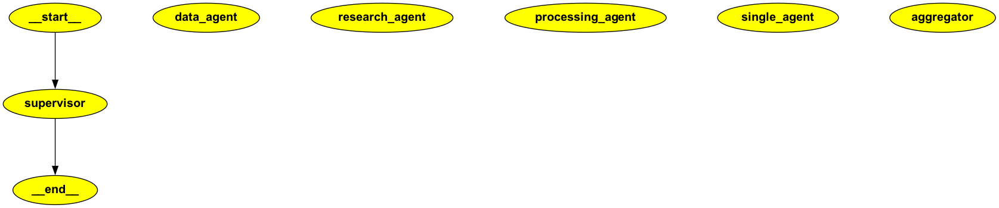

# MULTI-AGENT GRAPH



# 📊 LangGraph Execution Report

**Generated on:** `2025-10-08 22:06:38`
**Total Duration:** `7.4477 seconds`

## 📈 Aggregate Statistics

- **Total Tokens Used:** `579`
- **Total Tool Calls:** `1`
- **Total Tool Executions:** `1`
- **Total Messages:** `5`
- **Models Used:** `google/gemini-2.5-flash`
- **Number of Nodes:** `5`

--- 

## 📝 Execution Summary

| Node Name           | Duration (s) | Tokens | Tools | New Messages |
|---------------------|--------------|--------|-------|---------------|
| `supervisor` | not visited | <n/a>  | <n/a> | <n/a>         |
| `data_agent_20251008-220640-805` | 1.0327       | 107    | 0     | 1             |
| **Total:data_agent** | 1.0327     | 107  | 0   | 0           |
| `research_agent_20251008-220640-659` | 0.8159       | 110    | 0     | 1             |
| **Total:research_agent** | 0.8159     | 110  | 0   | 0           |
| `processing_agent_20251008-220641-270` | 1.4266       | 107    | 0     | 1             |
| **Total:processing_agent** | 1.4266     | 107  | 0   | 0           |
| `single_agent_20251008-220645-751` | 3.8606       | 255    | 1     | 3             |
| **Total:single_agent** | 3.8606     | 255  | 1   | 0           |
| `aggregator_20251008-220641-275` | 0.0025       | 0      | 0     | -4            |
| **Total:aggregator** | 0.0025     | 0    | 0   | 0           |


## 🔍 Node Details

--- 

### 1. Node: `research_agent`

**Description:**
```
Research agent - uses fetch_information tool.
```

- **Timestamp:** `22:06:39.843`
- **Duration:** `0.8159 seconds`
- **Messages Before/After:** `2` → `3` (➕ 1)
- **State Keys:** `messages, parallel_results`

**🤖 Model Information:**
- **Model Name:** `google/gemini-2.5-flash`
- **Finish Reason:** `stop`

**📊 Token Usage:**
- **Input Tokens:** `76`
- **Output Tokens:** `34`
- **Total Tokens:** `110`

**📥 Model Final Response:**
```text
 is missing. Only fetch_information is available. I cannot use parallel processing. I can fetch information on market trends, though. Would you like me to do that?
```

 **FULL CONVERSATION HISTORY FOR research_agent:**

**💬 Messages Added (1):**
1. **AIMessage** (ID: `run--4f1df39c-8384-4...`)
   - **Content:** ` is missing. Only fetch_information is available. I cannot use parallel processing. I can fetch information on market trends, though. Would you like me to do that?`

**🔄 State Changes:**
```json
{
  "messages": {
    "changed_from": "[[{'content': 'I need to analyze complex data - use parallel processing', 'additional_kwargs': {}, 'response_metadata': {}, 'type': 'human', 'name': None, 'id': '0c1a6d8e-396d-4d76-bc6f-0e2dad05ba77'}, {'content': 'parallel_route', 'additional_kwargs': {'refusal': None}, 'response_metadata': {'token_usage': {'completion_tokens': 3, 'prompt_tokens': 114, 'total_tokens': 117, 'completion_tokens_details': {'accepted_prediction_tokens': None, 'audio_tokens': None, 'reasoning_tokens': 0, 'rejected_prediction_tokens': None, 'image_tokens': 0}, 'prompt_tokens_details': {'audio_tokens': None, 'cached_tokens': 0}}, 'model_name': 'google/gemini-2.5-flash', 'system_fingerprint': None, 'id': 'gen-1759953998-2h84nNtYDP4SjJJbFfgP', 'service_tier': None, 'finish_reason': 'stop', 'logprobs': None}, 'type': 'ai', 'name': 'supervisor', 'id': 'run--0edab960-44f5-4e0e-8265-714f6d63a23c-0'}]]",
    "changed_to": "[[HumanMessage(content='I need to analyze complex data - use parallel processing', additional_kwargs={}, response_metadata={}, id='0c1a6d8e-396d-4d76-bc6f-0e2dad05ba77'), AIMessage(content='parallel_route', additional_kwargs={'refusal': None}, response_metadata={'token_usage': {'completion_tokens': 3, 'prompt_tokens': 114, 'total_tokens': 117, 'completion_tokens_details': {'accepted_prediction_tokens': None, 'audio_tokens': None, 'reasoning_tokens': 0, 'rejected_prediction_tokens': None, 'image_tokens': 0}, 'prompt_tokens_details': {'audio_tokens': None, 'cached_tokens': 0}}, 'model_name': 'google/gemini-2.5-flash', 'system_fingerprint': None, 'id': 'gen-1759953998-2h84nNtYDP4SjJJbFfgP', 'service_tier': None, 'finish_reason': 'stop', 'logprobs': None}, name='supervisor', id='run--0edab960-44f5-4e0e-8265-714f6d63a23c-0', usage_metadata={'input_tokens': 114, 'output_tokens': 3, 'total_tokens': 117, 'input_token_details': {'cache_read': 0}, 'output_token_details': {'reasoning': 0}}), AIMessage(content=' is missing. Only fetch_information is available. I cannot use parallel processing. I can fetch information on market trends, though. Would you like me to do that?', additional_kwargs={'refusal': None}, response_metadata={'token_usage': {'completion_tokens': 34, 'prompt_tokens': 76, 'total_tokens': 110, 'completion_tokens_details': {'accepted_prediction_tokens': None, 'audio_tokens': None, 'reasoning_tokens': 0, 'rejected_prediction_tokens': None, 'image_tokens': 0}, 'prompt_tokens_details': {'audio_tokens': None, 'cached_tokens': 0}}, 'model_name': 'google/gemini-2.5-flash', 'system_fingerprint': None, 'id': 'gen-1759954000-ZTy5LzOvIkOHgCP70dZx', 'service_tier': None, 'finish_reason': 'stop', 'logprobs': None}, name='research_agent', id='run--4f1df39c-8384-4bf6-bb81-2541cdb73dfb-0', usage_metadata={'input_tokens': 76, 'output_tokens': 34, 'total_tokens': 110, 'input_token_details': {'cache_read': 0}, 'output_token_details': {'reasoning': 0}})]]"
  },
  "task_type": {
    "changed_from": "parallel",
    "changed_to": "None"
  },
  "parallel_results": {
    "changed_from": "[[]]",
    "changed_to": "[['Research agent completed']]"
  }
}
```

--- 

### 2. Node: `data_agent`

**Description:**
```
Data analysis agent - uses analyze_data tool.
```

- **Timestamp:** `22:06:39.772`
- **Duration:** `1.0327 seconds`
- **Messages Before/After:** `2` → `3` (➕ 1)
- **State Keys:** `messages, parallel_results`

**🤖 Model Information:**
- **Model Name:** `google/gemini-2.5-flash`
- **Finish Reason:** `stop`

**📊 Token Usage:**
- **Input Tokens:** `81`
- **Output Tokens:** `26`
- **Total Tokens:** `107`

**📥 Model Final Response:**
```text
 is not an available tool. However, I can analyze financial_metrics data for you. Would you like me to do that?
```

 **FULL CONVERSATION HISTORY FOR data_agent:**

**💬 Messages Added (1):**
1. **AIMessage** (ID: `run--6f9f2726-fce8-4...`)
   - **Content:** ` is not an available tool. However, I can analyze financial_metrics data for you. Would you like me to do that?`

**🔄 State Changes:**
```json
{
  "messages": {
    "changed_from": "[[{'content': 'I need to analyze complex data - use parallel processing', 'additional_kwargs': {}, 'response_metadata': {}, 'type': 'human', 'name': None, 'id': '0c1a6d8e-396d-4d76-bc6f-0e2dad05ba77'}, {'content': 'parallel_route', 'additional_kwargs': {'refusal': None}, 'response_metadata': {'token_usage': {'completion_tokens': 3, 'prompt_tokens': 114, 'total_tokens': 117, 'completion_tokens_details': {'accepted_prediction_tokens': None, 'audio_tokens': None, 'reasoning_tokens': 0, 'rejected_prediction_tokens': None, 'image_tokens': 0}, 'prompt_tokens_details': {'audio_tokens': None, 'cached_tokens': 0}}, 'model_name': 'google/gemini-2.5-flash', 'system_fingerprint': None, 'id': 'gen-1759953998-2h84nNtYDP4SjJJbFfgP', 'service_tier': None, 'finish_reason': 'stop', 'logprobs': None}, 'type': 'ai', 'name': 'supervisor', 'id': 'run--0edab960-44f5-4e0e-8265-714f6d63a23c-0'}]]",
    "changed_to": "[[HumanMessage(content='I need to analyze complex data - use parallel processing', additional_kwargs={}, response_metadata={}, id='0c1a6d8e-396d-4d76-bc6f-0e2dad05ba77'), AIMessage(content='parallel_route', additional_kwargs={'refusal': None}, response_metadata={'token_usage': {'completion_tokens': 3, 'prompt_tokens': 114, 'total_tokens': 117, 'completion_tokens_details': {'accepted_prediction_tokens': None, 'audio_tokens': None, 'reasoning_tokens': 0, 'rejected_prediction_tokens': None, 'image_tokens': 0}, 'prompt_tokens_details': {'audio_tokens': None, 'cached_tokens': 0}}, 'model_name': 'google/gemini-2.5-flash', 'system_fingerprint': None, 'id': 'gen-1759953998-2h84nNtYDP4SjJJbFfgP', 'service_tier': None, 'finish_reason': 'stop', 'logprobs': None}, name='supervisor', id='run--0edab960-44f5-4e0e-8265-714f6d63a23c-0', usage_metadata={'input_tokens': 114, 'output_tokens': 3, 'total_tokens': 117, 'input_token_details': {'cache_read': 0}, 'output_token_details': {'reasoning': 0}}), AIMessage(content=' is not an available tool. However, I can analyze financial_metrics data for you. Would you like me to do that?', additional_kwargs={'refusal': None}, response_metadata={'token_usage': {'completion_tokens': 26, 'prompt_tokens': 81, 'total_tokens': 107, 'completion_tokens_details': {'accepted_prediction_tokens': None, 'audio_tokens': None, 'reasoning_tokens': 0, 'rejected_prediction_tokens': None, 'image_tokens': 0}, 'prompt_tokens_details': {'audio_tokens': None, 'cached_tokens': 0}}, 'model_name': 'google/gemini-2.5-flash', 'system_fingerprint': None, 'id': 'gen-1759954000-X1MrRyJ4z6QxMN8uQneq', 'service_tier': None, 'finish_reason': 'stop', 'logprobs': None}, name='data_agent', id='run--6f9f2726-fce8-4225-82d4-9f1ce3e3cbb6-0', usage_metadata={'input_tokens': 81, 'output_tokens': 26, 'total_tokens': 107, 'input_token_details': {'cache_read': 0}, 'output_token_details': {'reasoning': 0}})]]"
  },
  "task_type": {
    "changed_from": "parallel",
    "changed_to": "None"
  },
  "parallel_results": {
    "changed_from": "[[]]",
    "changed_to": "[['Data agent completed']]"
  }
}
```

--- 

### 3. Node: `processing_agent`

**Description:**
```
Processing agent - uses process_request tool.
```

- **Timestamp:** `22:06:39.843`
- **Duration:** `1.4266 seconds`
- **Messages Before/After:** `2` → `3` (➕ 1)
- **State Keys:** `messages, parallel_results`

**🤖 Model Information:**
- **Model Name:** `google/gemini-2.5-flash`
- **Finish Reason:** `stop`

**📊 Token Usage:**
- **Input Tokens:** `76`
- **Output Tokens:** `31`
- **Total Tokens:** `107`

**📥 Model Final Response:**
```text
 is not a valid tool. You can only use the process_request tool. Would you like me to process your request using the process_request tool?

```

 **FULL CONVERSATION HISTORY FOR processing_agent:**

**💬 Messages Added (1):**
1. **AIMessage** (ID: `run--b607689a-e3f6-4...`)
   - **Content:** ` is not a valid tool. You can only use the process_request tool. Would you like me to process your request using the process_request tool?
`

**🔄 State Changes:**
```json
{
  "messages": {
    "changed_from": "[[{'content': 'I need to analyze complex data - use parallel processing', 'additional_kwargs': {}, 'response_metadata': {}, 'type': 'human', 'name': None, 'id': '0c1a6d8e-396d-4d76-bc6f-0e2dad05ba77'}, {'content': 'parallel_route', 'additional_kwargs': {'refusal': None}, 'response_metadata': {'token_usage': {'completion_tokens': 3, 'prompt_tokens': 114, 'total_tokens': 117, 'completion_tokens_details': {'accepted_prediction_tokens': None, 'audio_tokens': None, 'reasoning_tokens': 0, 'rejected_prediction_tokens': None, 'image_tokens': 0}, 'prompt_tokens_details': {'audio_tokens': None, 'cached_tokens': 0}}, 'model_name': 'google/gemini-2.5-flash', 'system_fingerprint': None, 'id': 'gen-1759953998-2h84nNtYDP4SjJJbFfgP', 'service_tier': None, 'finish_reason': 'stop', 'logprobs': None}, 'type': 'ai', 'name': 'supervisor', 'id': 'run--0edab960-44f5-4e0e-8265-714f6d63a23c-0'}]]",
    "changed_to": "[[HumanMessage(content='I need to analyze complex data - use parallel processing', additional_kwargs={}, response_metadata={}, id='0c1a6d8e-396d-4d76-bc6f-0e2dad05ba77'), AIMessage(content='parallel_route', additional_kwargs={'refusal': None}, response_metadata={'token_usage': {'completion_tokens': 3, 'prompt_tokens': 114, 'total_tokens': 117, 'completion_tokens_details': {'accepted_prediction_tokens': None, 'audio_tokens': None, 'reasoning_tokens': 0, 'rejected_prediction_tokens': None, 'image_tokens': 0}, 'prompt_tokens_details': {'audio_tokens': None, 'cached_tokens': 0}}, 'model_name': 'google/gemini-2.5-flash', 'system_fingerprint': None, 'id': 'gen-1759953998-2h84nNtYDP4SjJJbFfgP', 'service_tier': None, 'finish_reason': 'stop', 'logprobs': None}, name='supervisor', id='run--0edab960-44f5-4e0e-8265-714f6d63a23c-0', usage_metadata={'input_tokens': 114, 'output_tokens': 3, 'total_tokens': 117, 'input_token_details': {'cache_read': 0}, 'output_token_details': {'reasoning': 0}}), AIMessage(content=' is not a valid tool. You can only use the process_request tool. Would you like me to process your request using the process_request tool?\\n', additional_kwargs={'refusal': None}, response_metadata={'token_usage': {'completion_tokens': 31, 'prompt_tokens': 76, 'total_tokens': 107, 'completion_tokens_details': {'accepted_prediction_tokens': None, 'audio_tokens': None, 'reasoning_tokens': 0, 'rejected_prediction_tokens': None, 'image_tokens': 0}, 'prompt_tokens_details': {'audio_tokens': None, 'cached_tokens': 0}}, 'model_name': 'google/gemini-2.5-flash', 'system_fingerprint': None, 'id': 'gen-1759954000-9FshhtKUxrXeTae4RTOH', 'service_tier': None, 'finish_reason': 'stop', 'logprobs': None}, name='processing_agent', id='run--b607689a-e3f6-4d10-805b-c726b35a68e1-0', usage_metadata={'input_tokens': 76, 'output_tokens': 31, 'total_tokens': 107, 'input_token_details': {'cache_read': 0}, 'output_token_details': {'reasoning': 0}})]]"
  },
  "task_type": {
    "changed_from": "parallel",
    "changed_to": "None"
  },
  "parallel_results": {
    "changed_from": "[[]]",
    "changed_to": "[['Processing agent completed']]"
  }
}
```

--- 

### 4. Node: `aggregator`

**Description:**
```
Collect results from parallel agents.
```

- **Timestamp:** `22:06:41.272`
- **Duration:** `0.0025 seconds`
- **Messages Before/After:** `5` → `1` (➕ -4)
- **State Keys:** `messages`

**📊 Token Usage:**
- **Input Tokens:** `0`
- **Output Tokens:** `0`
- **Total Tokens:** `0`

**🔄 State Changes:**
```json
{
  "parallel_results": {
    "changed_from": "[['Data agent completed', 'Research agent completed', 'Processing agent completed']]",
    "changed_to": "None"
  },
  "task_type": {
    "changed_from": "parallel",
    "changed_to": "None"
  },
  "messages": {
    "changed_from": "[[{'content': 'I need to analyze complex data - use parallel processing', 'additional_kwargs': {}, 'response_metadata': {}, 'type': 'human', 'name': None, 'id': '0c1a6d8e-396d-4d76-bc6f-0e2dad05ba77'}, {'content': 'parallel_route', 'additional_kwargs': {'refusal': None}, 'response_metadata': {'token_usage': {'completion_tokens': 3, 'prompt_tokens': 114, 'total_tokens': 117, 'completion_tokens_details': {'accepted_prediction_tokens': None, 'audio_tokens': None, 'reasoning_tokens': 0, 'rejected_prediction_tokens': None, 'image_tokens': 0}, 'prompt_tokens_details': {'audio_tokens': None, 'cached_tokens': 0}}, 'model_name': 'google/gemini-2.5-flash', 'system_fingerprint': None, 'id': 'gen-1759953998-2h84nNtYDP4SjJJbFfgP', 'service_tier': None, 'finish_reason': 'stop', 'logprobs': None}, 'type': 'ai', 'name': 'supervisor', 'id': 'run--0edab960-44f5-4e0e-8265-714f6d63a23c-0'}, {'content': ' is not an available tool. However, I can analyze financial_metrics data for you. Would you like me to do that?', 'additional_kwargs': {'refusal': None}, 'response_metadata': {'token_usage': {'completion_tokens': 26, 'prompt_tokens': 81, 'total_tokens': 107, 'completion_tokens_details': {'accepted_prediction_tokens': None, 'audio_tokens': None, 'reasoning_tokens': 0, 'rejected_prediction_tokens': None, 'image_tokens': 0}, 'prompt_tokens_details': {'audio_tokens': None, 'cached_tokens': 0}}, 'model_name': 'google/gemini-2.5-flash', 'system_fingerprint': None, 'id': 'gen-1759954000-X1MrRyJ4z6QxMN8uQneq', 'service_tier': None, 'finish_reason': 'stop', 'logprobs': None}, 'type': 'ai', 'name': 'data_agent', 'id': 'run--6f9f2726-fce8-4225-82d4-9f1ce3e3cbb6-0'}, {'content': ' is missing. Only fetch_information is available. I cannot use parallel processing. I can fetch information on market trends, though. Would you like me to do that?', 'additional_kwargs': {'refusal': None}, 'response_metadata': {'token_usage': {'completion_tokens': 34, 'prompt_tokens': 76, 'total_tokens': 110, 'completion_tokens_details': {'accepted_prediction_tokens': None, 'audio_tokens': None, 'reasoning_tokens': 0, 'rejected_prediction_tokens': None, 'image_tokens': 0}, 'prompt_tokens_details': {'audio_tokens': None, 'cached_tokens': 0}}, 'model_name': 'google/gemini-2.5-flash', 'system_fingerprint': None, 'id': 'gen-1759954000-ZTy5LzOvIkOHgCP70dZx', 'service_tier': None, 'finish_reason': 'stop', 'logprobs': None}, 'type': 'ai', 'name': 'research_agent', 'id': 'run--4f1df39c-8384-4bf6-bb81-2541cdb73dfb-0'}, {'content': ' is not a valid tool. You can only use the process_request tool. Would you like me to process your request using the process_request tool?\\n', 'additional_kwargs': {'refusal': None}, 'response_metadata': {'token_usage': {'completion_tokens': 31, 'prompt_tokens': 76, 'total_tokens': 107, 'completion_tokens_details': {'accepted_prediction_tokens': None, 'audio_tokens': None, 'reasoning_tokens': 0, 'rejected_prediction_tokens': None, 'image_tokens': 0}, 'prompt_tokens_details': {'audio_tokens': None, 'cached_tokens': 0}}, 'model_name': 'google/gemini-2.5-flash', 'system_fingerprint': None, 'id': 'gen-1759954000-9FshhtKUxrXeTae4RTOH', 'service_tier': None, 'finish_reason': 'stop', 'logprobs': None}, 'type': 'ai', 'name': 'processing_agent', 'id': 'run--b607689a-e3f6-4d10-805b-c726b35a68e1-0'}]]",
    "changed_to": "[[HumanMessage(content='Parallel execution complete! Collected 3 results.', additional_kwargs={}, response_metadata={})]]"
  }
}
```

--- 

### 5. Node: `single_agent`

**Description:**
```
Simple single agent for non-parallel tasks.
```

- **Timestamp:** `22:06:41.890`
- **Duration:** `3.8606 seconds`
- **Messages Before/After:** `2` → `5` (➕ 3)
- **State Keys:** `messages`

**🤖 Model Information:**
- **Model Name:** `google/gemini-2.5-flash`
- **Finish Reason:** `tool_calls`

**📊 Token Usage:**
- **Input Tokens:** `221`
- **Output Tokens:** `34`
- **Total Tokens:** `255`

**📥 Model Final Response:**
```text
Analysis of simple_task complete (took 2.00s)
```

**🛠️ Tool Calls (1):**
1. **Tool:** `analyze_data`
   - **Call ID:** `tool_0_analyze_data_Znf2Oebo7caRL9DySey9`
   - **Arguments:** `{'data_type': 'simple_task'}`

**✅ Tool Executions (1):**
1. **Tool:** `analyze_data`
   - **Status:** `success`
   - **Call ID:** `tool_0_analyze_data_Znf2Oebo7caRL9DySey9`
   - **Response:** `Analysis of simple_task complete (took 2.00s)`

**🧠 Thinking Process (1 steps):**

---

 0)


 **FULL CONVERSATION HISTORY FOR single_agent:**

**💬 Messages Added (3):**
1. **AIMessage** (ID: `run--8f785b6a-cf7b-4...`)
   - **Has Tool Calls:** ✅
   - **Content:** `
`
2. **ToolMessage** (ID: `dcaca55d-4e32-4a40-b...`)
   - **Tool Call ID:** `tool_0_analyze_data_Znf2Oebo7caRL9DySey9`
   - **Content:** `Analysis of simple_task complete (took 2.00s)`
3. **AIMessage** (ID: `run--c127dee0-c8c6-4...`)
   - **Content:** `Analysis of simple_task complete (took 2.00s)`

**🔄 State Changes:**
```json
{
  "parallel_results": {
    "changed_from": "[[]]",
    "changed_to": "None"
  },
  "task_type": {
    "changed_from": "single",
    "changed_to": "None"
  },
  "messages": {
    "changed_from": "[[{'content': 'Simple task - no need for parallelism', 'additional_kwargs': {}, 'response_metadata': {}, 'type': 'human', 'name': None, 'id': '67bcc4f2-50ec-4d4d-9613-8116c93aecf2'}, {'content': 'single_route', 'additional_kwargs': {'refusal': None}, 'response_metadata': {'token_usage': {'completion_tokens': 3, 'prompt_tokens': 111, 'total_tokens': 114, 'completion_tokens_details': {'accepted_prediction_tokens': None, 'audio_tokens': None, 'reasoning_tokens': 0, 'rejected_prediction_tokens': None, 'image_tokens': 0}, 'prompt_tokens_details': {'audio_tokens': None, 'cached_tokens': 0}}, 'model_name': 'google/gemini-2.5-flash', 'system_fingerprint': None, 'id': 'gen-1759954001-YO0CFdh885CwgZ1eusrk', 'service_tier': None, 'finish_reason': 'stop', 'logprobs': None}, 'type': 'ai', 'name': 'supervisor', 'id': 'run--a2c289fa-e1a0-4045-963d-d4a187f2faae-0'}]]",
    "changed_to": "[[HumanMessage(content='Simple task - no need for parallelism', additional_kwargs={}, response_metadata={}, id='67bcc4f2-50ec-4d4d-9613-8116c93aecf2'), AIMessage(content='single_route', additional_kwargs={'refusal': None}, response_metadata={'token_usage': {'completion_tokens': 3, 'prompt_tokens': 111, 'total_tokens': 114, 'completion_tokens_details': {'accepted_prediction_tokens': None, 'audio_tokens': None, 'reasoning_tokens': 0, 'rejected_prediction_tokens': None, 'image_tokens': 0}, 'prompt_tokens_details': {'audio_tokens': None, 'cached_tokens': 0}}, 'model_name': 'google/gemini-2.5-flash', 'system_fingerprint': None, 'id': 'gen-1759954001-YO0CFdh885CwgZ1eusrk', 'service_tier': None, 'finish_reason': 'stop', 'logprobs': None}, name='supervisor', id='run--a2c289fa-e1a0-4045-963d-d4a187f2faae-0', usage_metadata={'input_tokens': 111, 'output_tokens': 3, 'total_tokens': 114, 'input_token_details': {'cache_read': 0}, 'output_token_details': {'reasoning': 0}}), AIMessage(content='\\n', additional_kwargs={'tool_calls': [{'id': 'tool_0_analyze_data_Znf2Oebo7caRL9DySey9', 'function': {'arguments': '{\"data_type\":\"simple_task\"}', 'name': 'analyze_data'}, 'type': 'function', 'index': 0}], 'refusal': None}, response_metadata={'token_usage': {'completion_tokens': 19, 'prompt_tokens': 78, 'total_tokens': 97, 'completion_tokens_details': {'accepted_prediction_tokens': None, 'audio_tokens': None, 'reasoning_tokens': 0, 'rejected_prediction_tokens': None, 'image_tokens': 0}, 'prompt_tokens_details': {'audio_tokens': None, 'cached_tokens': 0}}, 'model_name': 'google/gemini-2.5-flash', 'system_fingerprint': None, 'id': 'gen-1759954002-3uM4oTgPtAy0L7FgVmzl', 'service_tier': None, 'finish_reason': 'tool_calls', 'logprobs': None}, name='single_agent', id='run--8f785b6a-cf7b-4cb6-9c40-0e64480adaa6-0', tool_calls=[{'name': 'analyze_data', 'args': {'data_type': 'simple_task'}, 'id': 'tool_0_analyze_data_Znf2Oebo7caRL9DySey9', 'type': 'tool_call'}], usage_metadata={'input_tokens': 78, 'output_tokens': 19, 'total_tokens': 97, 'input_token_details': {'cache_read': 0}, 'output_token_details': {'reasoning': 0}}), ToolMessage(content='Analysis of simple_task complete (took 2.00s)', name='analyze_data', id='dcaca55d-4e32-4a40-b785-03036f7782ac', tool_call_id='tool_0_analyze_data_Znf2Oebo7caRL9DySey9'), AIMessage(content='Analysis of simple_task complete (took 2.00s)', additional_kwargs={'refusal': None}, response_metadata={'token_usage': {'completion_tokens': 15, 'prompt_tokens': 143, 'total_tokens': 158, 'completion_tokens_details': {'accepted_prediction_tokens': None, 'audio_tokens': None, 'reasoning_tokens': 0, 'rejected_prediction_tokens': None, 'image_tokens': 0}, 'prompt_tokens_details': {'audio_tokens': None, 'cached_tokens': 0}}, 'model_name': 'google/gemini-2.5-flash', 'system_fingerprint': None, 'id': 'gen-1759954005-9iQaRYw1oRCC8n9ON8xd', 'service_tier': None, 'finish_reason': 'stop', 'logprobs': None}, name='single_agent', id='run--c127dee0-c8c6-4e1f-957d-2ce735b01bcc-0', usage_metadata={'input_tokens': 143, 'output_tokens': 15, 'total_tokens': 158, 'input_token_details': {'cache_read': 0}, 'output_token_details': {'reasoning': 0}})]]"
  }
}
```

--- 

## ✅ Final State Summary

