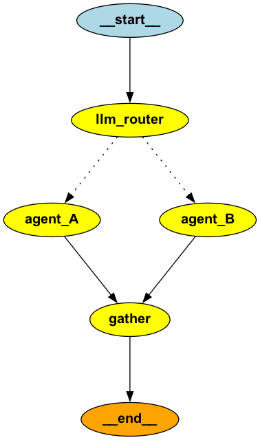

# MULTI-AGENT GRAPH



# 📊 LangGraph Execution Report

**Generated on:** `2025-10-16 21:33:29`
**Total Duration:** `13.2587 seconds`

## 📈 Aggregate Statistics

- **Total Tokens Used:** `160`
- **Total Tool Calls:** `0`
- **Total Tool Executions:** `0`
- **Total Messages:** `3`
- **Models Used:** `google/gemini-2.5-flash`
- **Number of Nodes:** `4`

--- 

## 📝 Execution Summary

| Node Name           | Duration (s) | Tokens | Tools | New Messages |
|---------------------|--------------|--------|-------|---------------|
| `llm_router_20251016-213338-079` | 8.5822       | 0      | 0     | 0             |
| **Total:llm_router** | 8.5822     | 0    | 0   | 0           |
| `agent_A_20251016-213341-097` | 3.0137       | 0      | 0     | 0             |
| **Total:agent_A** | 3.0137     | 0    | 0   | 0           |
| `agent_B_20251016-213341-101` | 3.0176       | 0      | 0     | 0             |
| **Total:agent_B** | 3.0176     | 0    | 0   | 0           |
| `gather_20251016-213342-610` | 1.5067       | 160    | 0     | 3             |
| **Total:gather** | 1.5067     | 160  | 0   | 0           |


## 🔍 Node Details

--- 

### 1. Node: `llm_router`

**Description:**
```
LLM decides which agent(s) to route to based on user query.
```

- **Timestamp:** `21:33:29.496`
- **Duration:** `8.5822 seconds`
- **Messages Before/After:** `0` → `0` (➕ 0)
- **State Keys:** `query, routing_decision, routing_rationale, results, final_summary, messages`

**📊 Token Usage:**
- **Input Tokens:** `0`
- **Output Tokens:** `0`
- **Total Tokens:** `0`

**🔄 State Changes:**
```json
{
  "routing_rationale": {
    "changed_from": "None",
    "changed_to": "The user's query contains two distinct requests. 'Analyze the data' requires data processing capabilities, which maps to agent_A. 'explain what parallelism means' is an information retrieval task, which maps to agent_B. Therefore, both agents are selected to handle the different parts of the query."
  },
  "routing_decision": {
    "changed_from": "None",
    "changed_to": "[['agent_A', 'agent_B']]"
  }
}
```

--- 

### 2. Node: `agent_A`

- **Timestamp:** `21:33:38.082`
- **Duration:** `3.0137 seconds`
- **Messages Before/After:** `0` → `0` (➕ 0)
- **State Keys:** `results`

**📊 Token Usage:**
- **Input Tokens:** `0`
- **Output Tokens:** `0`
- **Total Tokens:** `0`

**🔄 State Changes:**
```json
{
  "routing_rationale": {
    "changed_from": "The user's query contains two distinct requests. 'Analyze the data' requires data processing capabilities, which maps to agent_A. 'explain what parallelism means' is an information retrieval task, which maps to agent_B. Therefore, both agents are selected to handle the different parts of the query.",
    "changed_to": "None"
  },
  "messages": {
    "changed_from": "[[]]",
    "changed_to": "None"
  },
  "query": {
    "changed_from": "Analyze the data and explain what parallelism means",
    "changed_to": "None"
  },
  "results": {
    "changed_from": "[{}]",
    "changed_to": "[{'agent_A': 'Data analysis complete: Analyze the data and explain what parallelism means'}]"
  },
  "routing_decision": {
    "changed_from": "[['agent_A', 'agent_B']]",
    "changed_to": "None"
  }
}
```

--- 

### 3. Node: `agent_B`

- **Timestamp:** `21:33:38.083`
- **Duration:** `3.0176 seconds`
- **Messages Before/After:** `0` → `0` (➕ 0)
- **State Keys:** `results`

**📊 Token Usage:**
- **Input Tokens:** `0`
- **Output Tokens:** `0`
- **Total Tokens:** `0`

**🔄 State Changes:**
```json
{
  "routing_rationale": {
    "changed_from": "The user's query contains two distinct requests. 'Analyze the data' requires data processing capabilities, which maps to agent_A. 'explain what parallelism means' is an information retrieval task, which maps to agent_B. Therefore, both agents are selected to handle the different parts of the query.",
    "changed_to": "None"
  },
  "messages": {
    "changed_from": "[[]]",
    "changed_to": "None"
  },
  "query": {
    "changed_from": "Analyze the data and explain what parallelism means",
    "changed_to": "None"
  },
  "results": {
    "changed_from": "[{}]",
    "changed_to": "[{'agent_b': 'Answer: Analyze the data and explain what parallelism means - Parallelism is executing multiple tasks simultaneously!'}]"
  },
  "routing_decision": {
    "changed_from": "[['agent_A', 'agent_B']]",
    "changed_to": "None"
  }
}
```

--- 

### 4. Node: `gather`

**Description:**
```
Gather and synthesize results from all executed agents using LLM.
```

- **Timestamp:** `21:33:41.102`
- **Duration:** `1.5067 seconds`
- **Messages Before/After:** `0` → `3` (➕ 3)
- **State Keys:** `query, routing_decision, routing_rationale, results, final_summary, messages`

**🤖 Model Information:**
- **Model Name:** `google/gemini-2.5-flash`
- **Finish Reason:** `stop`

**📊 Token Usage:**
- **Input Tokens:** `102`
- **Output Tokens:** `58`
- **Total Tokens:** `160`

**📥 Model Final Response:**
```text
The data analysis has been completed. Parallelism, in the context of data processing, refers to the ability to execute multiple computations or tasks simultaneously, often by dividing a larger problem into smaller, independent sub-problems that can be processed concurrently. This approach significantly speeds up the overall processing time.
```

 **FULL CONVERSATION HISTORY FOR gather:**

**💬 Messages Added (3):**
1. **SystemMessage** (ID: `3e792c1c-5044-4e73-9...`)
   - **Content:** `You are a synthesis agent that combines multiple agent outputs into a coherent response.`
2. **HumanMessage** (ID: `2d2453bd-412d-428d-9...`)
   - **Content:** `
You are a synthesis agent. Combine the following outputs from two parallel agents into a coherent, comprehensive response.

Agent A (Data Processing): Data analysis complete: Analyze the data and exp...`
3. **AIMessage** (ID: `run--f1e9d51b-3f03-4...`)
   - **Content:** `The data analysis has been completed. Parallelism, in the context of data processing, refers to the ability to execute multiple computations or tasks simultaneously, often by dividing a larger problem...`

**🔄 State Changes:**
```json
{
  "messages": {
    "changed_from": "[[]]",
    "changed_to": "[[{'content': 'You are a synthesis agent that combines multiple agent outputs into a coherent response.', 'additional_kwargs': {}, 'response_metadata': {}, 'type': 'system', 'name': None, 'id': '3e792c1c-5044-4e73-906d-682ef754b0e9'}, {'content': '\\nYou are a synthesis agent. Combine the following outputs from two parallel agents into a coherent, comprehensive response.\\n\\nAgent A (Data Processing): Data analysis complete: Analyze the data and explain what parallelism means\\n\\nAgent B (Question Answering): N/A\\n\\nOriginal Query: Analyze the data and explain what parallelism means\\n\\nCreate a brief, unified response that integrates both perspectives. Keep it concise (2-3 sentences).\\n', 'additional_kwargs': {}, 'response_metadata': {}, 'type': 'human', 'name': None, 'id': '2d2453bd-412d-428d-9ea1-0779d2dfedca'}, {'content': 'The data analysis has been completed. Parallelism, in the context of data processing, refers to the ability to execute multiple computations or tasks simultaneously, often by dividing a larger problem into smaller, independent sub-problems that can be processed concurrently. This approach significantly speeds up the overall processing time.', 'additional_kwargs': {'refusal': None}, 'response_metadata': {'token_usage': {'completion_tokens': 58, 'prompt_tokens': 102, 'total_tokens': 160, 'completion_tokens_details': {'accepted_prediction_tokens': None, 'audio_tokens': None, 'reasoning_tokens': 0, 'rejected_prediction_tokens': None, 'image_tokens': 0}, 'prompt_tokens_details': {'audio_tokens': None, 'cached_tokens': 0}}, 'model_name': 'google/gemini-2.5-flash', 'system_fingerprint': None, 'id': 'gen-1760643221-18tjj24daUz0TNEBIomY', 'service_tier': None, 'finish_reason': 'stop', 'logprobs': None}, 'type': 'ai', 'name': None, 'id': 'run--f1e9d51b-3f03-4f3e-ae1a-892eec57a979-0'}]]"
  },
  "final_summary": {
    "changed_from": "None",
    "changed_to": "The data analysis has been completed. Parallelism, in the context of data processing, refers to the ability to execute multiple computations or tasks simultaneously, often by dividing a larger problem into smaller, independent sub-problems that can be processed concurrently. This approach significan"
  }
}
```

--- 

## ✅ Final State Summary

**State Keys:** `query, routing_decision, routing_rationale, results, final_summary, messages`

- **query:** Analyze the data and explain what parallelism means
- **routing_decision:** ['agent_A', 'agent_B']
- **routing_rationale:** The user's query contains two distinct requests. 'Analyze the data' requires data processing capabilities, which maps to agent_A. 'explain what parallelism means' is an information retrieval task, which maps to agent_B. Therefore, both agents are selected to handle the different parts of the query.
- **results:** {'agent_A': 'Data analysis complete: Analyze the data and explain what parallelism means', 'agent_b': 'Answer: Analyze the data and explain what parallelism means - Parallelism is executing multiple tasks simultaneously!'}
- **final_summary:** The data analysis has been completed. Parallelism, in the context of data processing, refers to the ability to execute multiple computations or tasks simultaneously, often by dividing a larger problem into smaller, independent sub-problems that can be processed concurrently. This approach significantly speeds up the overall processing time.
- **messages:** [SystemMessage(content='You are a synthesis agent that combines multiple agent outputs into a coherent response.', additional_kwargs={}, response_metadata={}, id='3e792c1c-5044-4e73-906d-682ef754b0e9'), HumanMessage(content='\nYou are a synthesis agent. Combine the following outputs from two parallel agents into a coherent, comprehensive response.\n\nAgent A (Data Processing): Data analysis complete: Analyze the data and explain what parallelism means\n\nAgent B (Question Answering): N/A\n\nOriginal Query: Analyze the data and explain what parallelism means\n\nCreate a brief, unified response that integrates both perspectives. Keep it concise (2-3 sentences).\n', additional_kwargs={}, response_metadata={}, id='2d2453bd-412d-428d-9ea1-0779d2dfedca'), AIMessage(content='The data analysis has been completed. Parallelism, in the context of data processing, refers to the ability to execute multiple computations or tasks simultaneously, often by dividing a larger problem into smaller, independent sub-problems that can be processed concurrently. This approach significantly speeds up the overall processing time.', additional_kwargs={'refusal': None}, response_metadata={'token_usage': {'completion_tokens': 58, 'prompt_tokens': 102, 'total_tokens': 160, 'completion_tokens_details': {'accepted_prediction_tokens': None, 'audio_tokens': None, 'reasoning_tokens': 0, 'rejected_prediction_tokens': None, 'image_tokens': 0}, 'prompt_tokens_details': {'audio_tokens': None, 'cached_tokens': 0}}, 'model_name': 'google/gemini-2.5-flash', 'system_fingerprint': None, 'id': 'gen-1760643221-18tjj24daUz0TNEBIomY', 'service_tier': None, 'finish_reason': 'stop', 'logprobs': None}, id='run--f1e9d51b-3f03-4f3e-ae1a-892eec57a979-0', usage_metadata={'input_tokens': 102, 'output_tokens': 58, 'total_tokens': 160, 'input_token_details': {'cache_read': 0}, 'output_token_details': {'reasoning': 0}})]
